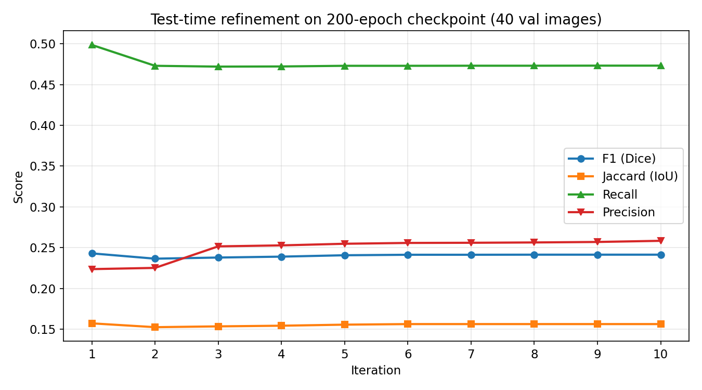
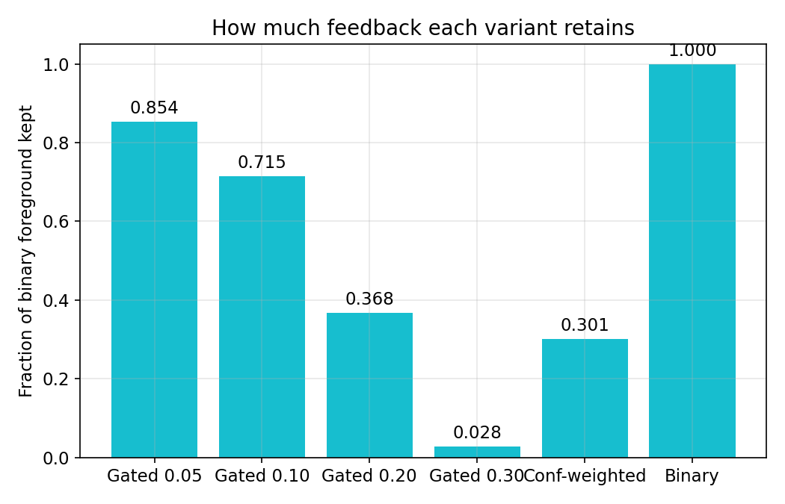

# [T5 – 27/08/2026]

## Mục tiêu tuần này

Chạy lại FANet trên Kaggle với GPU để có checkpoint chuẩn, sau đó kiểm định giả thuyết confidence-gated feedback: thay hard threshold bằng feedback có trọng số theo confidence nhằm giảm tỷ lệ hurt và tăng dice so với binary baseline.

## Done

- [x] Chạy training FANet trên Kaggle (GPU Tesla T4) đủ 200 epochs — notebook `notebooks/fanet_kaggle.py`, best val loss 0.5415
- [x] Upload 5 datasets lên Kaggle (kvasir-seg, kvasir-sessile, cvc-clinicdb, chase-db1, drive-vessel)
- [x] Download checkpoint 200 epochs từ Kaggle — `checkpoints/checkpoint_200ep_kaggle.pth` (29.67 MB, 562 keys khớp kiến trúc)
- [x] Chạy baseline evaluate đủ 10 iterations — `results/test_results.csv`
- [x] Viết và chạy thí nghiệm confidence-gated — `analysis/confgated_feedback.py`, log `logs/confgated_log.txt`
- [x] Sinh 5 biểu đồ minh chứng — `../../kaggle/figures/`

## Findings quan trọng

### 1. Giả thuyết confidence-gating KHÔNG được xác nhận

Mean dice qua 4 iterations trên 40 ảnh val (checkpoint 200 epochs):

- **Binary feedback vẫn tốt nhất** (0.2390), mọi biến thể confidence-based đều thấp hơn.
- Gated càng mạnh (tau càng cao) càng tệ: gated-0.3 giữ lại chỉ 2.8% foreground, delta âm so với none.
- Conf-weighted (0.2328) gần binary nhưng vẫn thấp hơn — giảm hurt nhưng cũng làm feedback yếu đi đều.

### 2. Help/hurt tại iteration cuối (so với none)

| Variant | Help | Hurt | Neutral | Mean delta |
|---|---:|---:|---:|---:|
| binary | 19 | 13 | 8 | +0.0321 |
| conf-weighted | 19 | 12 | 9 | +0.0259 |
| soft | 24 | 13 | 3 | +0.0118 |
| gated-0.05 | 18 | 12 | 10 | +0.0216 |
| gated-0.1 | 16 | 13 | 11 | +0.0147 |
| gated-0.2 | 16 | 12 | 12 | +0.0104 |
| gated-0.3 | 4 | 7 | 29 | -0.0018 |

Điểm đáng chú ý: **loại bỏ low-confidence pixels không chuyển đổi hurt thành help**, mà chỉ làm feedback yếu đi đều. Soft giúp nhiều case nhất (24) nhưng mean delta chỉ +0.0118 — giữ thông tin nhưng không đủ mạnh để tinh chỉnh.

### 3. Uncertainty vẫn correlate mạnh với lỗi (nền tảng của giả thuyết)

- Confidence < 0.1: error rate 48.7% (đoán mò); confidence > 0.35: 2.7%.
- FP tập trung ở vùng confidence thấp (35.3% vs 0.0%), FN phân bố đều hơn.
- Vậy vì sao gating không giúp? Vùng confidence thấp đúng là nơi nhiều lỗi, nhưng cắt nó đi đồng nghĩa cắt luôn vùng biên (nơi model cần guidance nhất) — lỗi và thông tin hữu ích nằm cùng một chỗ.

### 4. Feedback trên checkpoint 200 epochs gần như không giúp

- Iter 1 (Otsu): F1 0.2430 → Iter 10: F1 0.2414 (nhẹ giảm rồi plateau).
- Recall giảm dần 0.4986 → 0.4732: feedback từ prediction over-segmented khiến mask co lại.
- Đối chiếu checkpoint 53 epochs local (F1 0.3147 → 0.3268): refinement giúp rõ rệt. Sự khác biệt này cần xác minh (batch size, split, augmentation).

### 5. Oracle gap lớn — dư địa thực sự nằm ở đâu?

- Oracle đạt 0.3312 so với binary 0.2390 (gap 0.092) — lớn hơn nhiều so với chênh lệch giữa các biến thể feedback.
- Oracle khác prediction feedback ở chỗ: vùng background cũng chính xác tuyệt đối, không chỉ foreground. Prediction hiện tại over-segment nặng (precision 0.22-0.26) → feedback khuếch đại sai lầm ở vùng background.
- Hướng tiếp theo: **negative feedback** — đưa vùng background tin cậy vào mask (không chỉ foreground) để model học cả "đâu không phải polyp".

## Experiments

| Giả thuyết | Config | Kết quả | Link log |
|-----------|--------|---------|----------|
| Confidence-gated feedback giảm hurt và tăng dice | 9 variants x 4 iters x 40 ảnh, checkpoint 200ep | BÁC BỎ: binary 0.2390 tốt nhất; gated/weighted thấp hơn; hurt không giảm đáng kể | `logs/confgated_log.txt`, `results/confgated_summary.json` |
| Baseline refinement 10 iterations | 10 iters, 40 ảnh val, checkpoint 200ep | F1 0.2430 → 0.2414 (plateau, không giúp) | `results/test_results.csv` |

## Will Do (On going)

- [ ] Xác minh nguyên nhân checkpoint 200ep yếu hơn 53ep (batch size 4 vs 2, split khác nhau, CoarseDropout args invalid) — điều kiện tiên quyết cho mọi kết luận sau
- [ ] Chạy lại confidence-gated trên checkpoint 53ep để kiểm tra tính nhất quán của kết luận
- [ ] Nghiên cứu hướng mới: negative feedback (vùng background tin cậy) — đối chứng trực tiếp với oracle gap
- [ ] Phân tích oracle: so sánh từng pixel feedback oracle vs feedback prediction để xác định thông tin nào prediction thiếu
- [ ] Chưa mở rộng sang background context và deep supervision — giữ trọng tâm

## Any Stuck / Open Questions

- Kết quả âm tính (confidence-gating không giúp) cần kiểm tra chéo trên checkpoint 53ep trước khi coi là kết luận chắc chắn.
- Chưa rõ vì sao checkpoint 200ep (val loss 0.5415) kém hơn 53ep (val loss 0.505) — khả năng do split khác nhau, cần align điều kiện thí nghiệm.

## Đính kèm link chi tiết

- Notebook Kaggle (đã chạy): `kaggle/fanet-setup.ipynb` — source: `notebooks/fanet_kaggle.py`
- Checkpoint 200ep: `checkpoints/checkpoint_200ep_kaggle.pth`
- Script confgated: `analysis/confgated_feedback.py` — log: `logs/confgated_log.txt`
- Kết quả: `results/confgated_summary.json`, `results/confgated_variants.csv`, `results/test_results.csv`
- Biểu đồ: `../../kaggle/figures/` (fig1..fig5)
- Script download output Kaggle: `kaggle/download_outputs.ps1`
- Template: `docs/reports/_TEMPLATE.md` — Index: `docs/reports/README.md`
