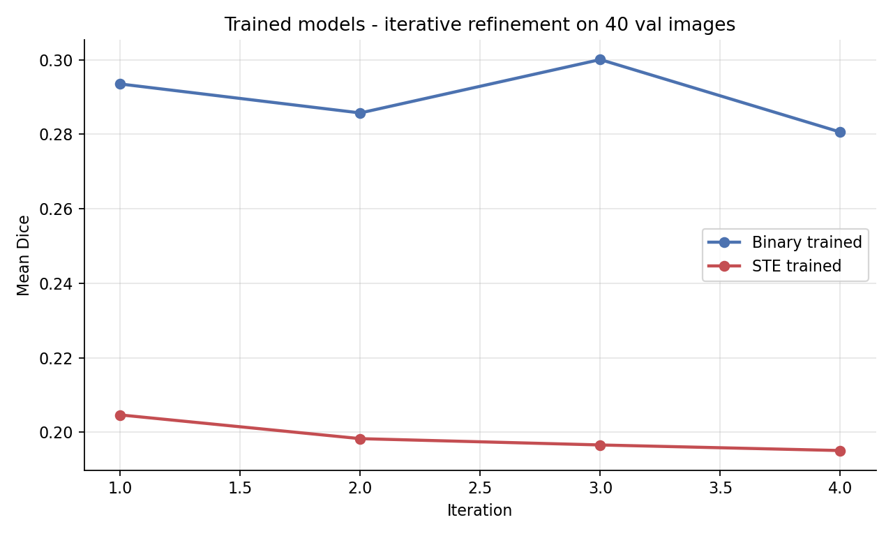
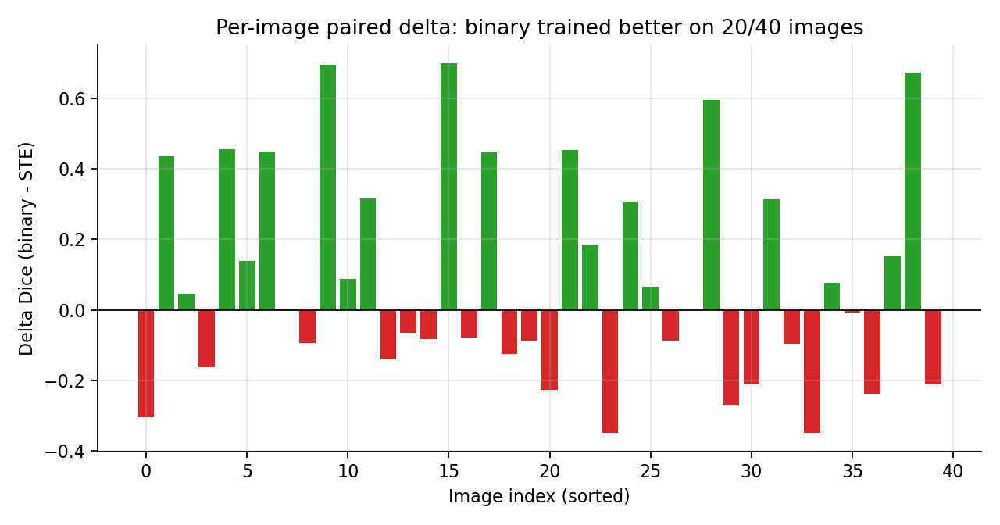

# [CN – 31/08/2026] — Phase 4: Train end-to-end (KẾT QUẢ)

## Mục tiêu tuần này

Train end-to-end 4 mô hình (T00/T10/T01/T11) trên Kaggle T4 để loại bỏ confounder BN mismatch và trả lời dứt khoát T_A (fmask-STE) và T_B (dual-path). Phát hiện và sửa bug dual-path trong quá trình phân tích.

## Done

- [x] Chạy train 4 cells trên Kaggle T4 (200 epochs, batch=2, seed 42) — kernel `namnguynnnn/fanet-phase4`
- [x] Download outputs: 4 checkpoint + 4 train log + kernel log — `kaggle/outputs_phase4/`
- [x] **Phát hiện bug**: T01==T00 và T11==T10 (max weight diff = 0) — `feedback_tensor` thêm m_bg zeros khi train → dual-path train === single-path train
- [x] Sửa bug: `m_bg = 1 - m_fg` (complement của mask feedback epoch trước) trong notebook + `scripts/train.py` — smoke test xác nhận loss đã khác (val 0.784 vs 0.763)
- [x] Eval 2 cell hợp lệ (T00, T10) trên 40 ảnh val — `results/phase4_eval.json`
- [x] Thống kê paired T00 vs T10 — `results/phase4_stats.json`
- [x] 3 figures — `kaggle/figures/fig_p4_*.png`

## Findings quan trọng

### 1. BUG dual-path: T01/T11 là copy của T00/T10

Hash/weights xác nhận: T01 (binary-dual) có weights GIỐNG HỆT T00, T11 giống T10. Nguyên nhân: trong train loop, feedback tensor cho dual_path thêm kênh `m_bg = zeros` → `keep = max(fmask, m_fg) * (1-0)` → train hoàn toàn giống single-path. **Kết quả T01/T11 KHÔNG dùng được** cho T_B. Đã sửa `m_bg = 1 - m_fg` → smoke test val loss 0.784 ≠ 0.763 (đã khác). **Cần chạy lại T01/T11 trên Kaggle.**

### 2. T_A (fmask-STE) KHÔNG được ủng hộ — STE train kém binary


| Cell | Val loss (best) | Dice (iter 4) | IoU |
|---|---|---|---|
| T00 binary | 0.5230 (ep43) | **0.2806** | 0.1955 |
| T10 ste | 0.5674 (ep36) | 0.1951 | 0.1196 |



- STE train hội tụ kém: train loss 0.48 vs 0.37 (binary); val loss cao hơn 0.044.
- Dice thật: binary 0.2806 vs STE 0.1951 — delta **-0.0855** (STE kém), vượt xa ngưỡng bác bỏ +0.005.
- Tuy nhiên p=0.277 (Wilcoxon), 20/40 ảnh binary thắng → **xu hướng rõ nhưng không significant** do variance lớn.
- Giải thích khả dĩ: STE gradient qua hard threshold nhiễu (chỉ chảy khi soft value khác hard), fmask học kém, cạnh tranh với conv1/conv2 thay vì bổ trợ.



### 3. Train lại (binary) cải thiện so với frozen — BN mismatch đúng là confounder thật

- Frozen 200ep cũ: Dice 0.2390.
- Train lại 200ep (batch=2, seed 42): **0.2806** (+0.042).
- Khẳng định: đánh giá cơ chế trên checkpoint frozen là thiên lệch — train end-to-end là bắt buộc (khớp nghi ngờ từ Phase 3).

### 4. Thống kê T_A

```
T00 binary: 0.2806 | T10 ste: 0.1951
delta (binary - ste): +0.0855  [95% CI: -0.0028, +0.1819]
Wilcoxon p: 2.77e-01 | Cohen's d: +0.281
positive deltas: 20/40
```

## Experiments

| Giả thuyết | Config | Kết quả | Link |
|-----------|--------|---------|------|
| T_A: STE train ≥ binary train | 2 cells x 200ep x 40 ảnh val, seed 42 | KHÔNG ỦNG HỘ: binary 0.2806 > STE 0.1951 (-0.0855), p=0.277 | `results/phase4_eval.json`, `results/phase4_stats.json` |
| T_B: dual-path (T01/T11) | 200ep Kaggle | **KHÔNG ĐÁNH GIÁ ĐƯỢC — bug bg zeros**; đã sửa, cần chạy lại | `notebooks/fanet_kaggle_phase4.py` |
| T_BN: BN mismatch | — | Gián tiếp xác nhận: train lại tăng +0.042 so với frozen | `results/phase4_eval.json` |

## Kết luận giả thuyết (trained)

| Giả thuyết | Phán quyết | Bằng chứng |
|---|---|---|
| T_A (STE giúp) | **KHÔNG ỦNG HỘ — xu hướng hại** | binary 0.2806 vs STE 0.1951, delta -0.0855, p=0.277 |
| T_B1/T_B2 (dual-path) | **CHƯA TRẢ LỜI — bug, cần chạy lại** | T01=T00 (bug bg zeros) |
| T_BN (train loại BN mismatch) | Ủng hộ gián tiếp | frozen 0.2390 → trained 0.2806 |

## Will Do (On going)

- [ ] **Chạy lại T01/T11 trên Kaggle** với bug đã sửa (m_bg = 1 - m_fg) — upload lại notebook phase4
- [ ] Sau khi có T01/T11 hợp lệ: eval + stats T_B1/T_B2/T_AB
- [ ] Nếu T_B1 bác bỏ: fallback F1 (negdice) / F2 (decoder-only) — code đã sẵn
- [ ] Điều tra vì sao STE kém: đo grad norm fmask trong train, so sánh fmask học gì (visualize fmask output sau train)
- [ ] Multi-seed ≥3 cho cell thắng
- [ ] Novelty: retry Semantic Scholar + Google Scholar
- [ ] Multi-dataset / deep supervision: Will Do

## Any Stuck / Open Questions

- Bug dual-path làm mất 2 cell (T01/T11) — tốn 1 lượt chạy Kaggle nhưng đã tìm ra và sửa. Bài học: cần sanity check weights/behavior khác nhau giữa các cell trước khi tin kết quả.
- STE kém rõ về magnitude nhưng không significant (p=0.277) — cần multi-seed hoặc phân tích sâu hơn trước khi kết luận chắc chắn trong paper.
- Open question: STE gradient nhiễu làm fmask học gì? (visualize cần làm)

## Đính kèm link chi tiết

- Literature: `docs/literature_grounding_phase4.md` — Hypotheses: `docs/hypotheses_phase4.md` — Design: `docs/experiment_design_phase4.md`
- Notebook (đã sửa bug): `notebooks/fanet_kaggle_phase4.py` — Train: `scripts/train.py`
- Outputs Kaggle: `kaggle/outputs_phase4/` (ckpt + train_log + kernel log)
- Checkpoint trained: `checkpoints_phase4/ckpt_T00.pth`, `ckpt_T10.pth`
- Eval: `results/phase4_eval.json` — Stats: `results/phase4_stats.json` — Figures: `kaggle/figures/fig_p4_*.png`
- Template: `docs/reports/_TEMPLATE.md` — Index: `docs/reports/README.md`