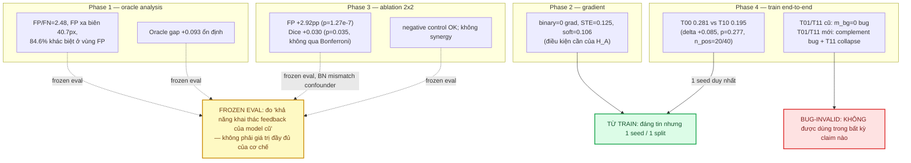
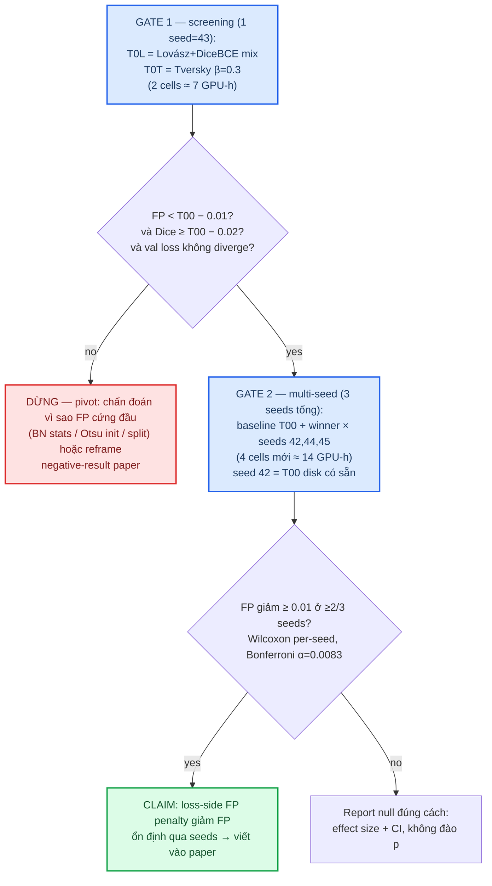

# [CN – 04/09/2026] — Next Directions: audit bằng chứng + literature grounding + xếp hạng hướng

## Mục tiêu tuần này

Phiên research strategy: đối chiếu TOÀN BỘ bằng chứng Phase 1–4, ground literature
đa nguồn (25 paper), đánh giá lại novelty của "background-aware feedback loop",
chẩn đoán 6 hướng nghiên cứu (X1–X6) với hypothesis/prediction/stopping rule, và
xếp hạng theo sức mạnh bằng chứng + chi phí. **Không chạy thí nghiệm mới** (ràng buộc).

## Done

- [x] Đọc + đối chiếu toàn bộ artifacts: reports 31/08 ×4, `docs/experiment_design*`,
      `docs/hypotheses*`, `results/phase4_*`, `logs/phase4_eval_log.txt`, notebook
      `kaggle/fanet-phase4.ipynb` (outputs cell 17 — run papermill 9/4), CSVs
      `kaggle/outputs_phase4/checkpoints/*.csv`
- [x] Literature search đa nguồn: OpenAlex 33 queries, arXiv 8, Europe PMC 5 →
      41 ứng viên → curated 25 paper (bảng đầy đủ: `docs/literature_grounding_next.md`)
- [x] Verify metadata 14 DOI ngược qua OpenAlex + đọc abstract 6 paper
      feedback-critical (FANetv2, FEGNet, predictive-coding polyp, context
      feedback loop, F³Net)
- [x] Download 29 PDF vào `docs/` — log: `docs/paper_download_log.json`;
      danh sách không tải được: `papers_not_accessible.md` (root repo)
- [x] Phân loại bằng chứng 3 mức: TỪ TRAIN / TỪ FROZEN EVAL / BUG-INVALID
- [x] Chẩn đoán X1–X6 + bảng xếp hạng + khuyến nghị

## Findings quan trọng

### F1. Phân loại bằng chứng (bắt buộc phân biệt khi claim)

| Claim | Loại bằng chứng | Độ tin | Ghi chú |
|---|---|---|---|
| FP/FN=2.48; FP cách biên 40.7px; 84.6% khác biệt ở vùng FP | FROZEN (checkpoint 200ep) | Cao cho *trạng thái hiện tại*, không cho cơ chế mới | Root cause đã xác nhận, chưa từng can thiệp từ phía loss |
| STE/soft hồi sinh gradient (0→0.125/0.106) | Analytic (CPU) | Cao | Chỉ là điều kiện cần |
| Dual-path frozen: FP **+2.92pp** p=1.27e-7 | FROZEN (đúng thiết kế confident-bg) | Cao về *hướng* | BN mismatch là confounder thật nhưng chiều hiệu ứng ngược mục tiêu |
| T00 0.281 vs T10 0.195 (disk) | TRAIN, 1 seed | Trung bình | p=0.277, CI [−0.003, 0.182], n_pos=20/40 → KHÔNG significant |
| Run mới 9/4: T00 0.5590 / T10 0.5611 val | TRAIN (notebook cell 17) | Trung bình | STE ≈ binary ở run này → "STE hại" cũng KHÔNG được xác lập |
| Run mới: T01 0.6478 val, T11 collapse (1.11–1.13 từ ep 40) | INVALID (complement bug) | Không dùng | Bug: `m_bg=1−m_fg` → `keep=max(fmask,m_fg)*(1−m_bg)=m_fg` → nhánh fmask bị triệt tiêu |
| `results/phase4_eval.json` T01 0.158 / T11 0.166 | INVALID (m_bg=0 lúc train, eval dual) | Không dùng | Model single-path train + eval dual-path = mismatch |

### F2. Novelty của "background-aware feedback loop": còn nhưng MỎNG

- **FANetv2 (ICASSP 2025, arXiv 2409.05875)** — chính lab FANet đã mở rộng:
  iterative mask feedback (epoch trước) + text-guided + refinement lúc test.
  Feedback vẫn foreground-only → kênh `m_bg` tường minh vẫn khác biệt, nhưng
  không gian "iterative mask feedback" đã bị chiếm bởi chính tác giả gốc.
- **Predictive coding polyp (Research Square 2026, 10.21203/rs.3.rs-9145958/v1)** —
  top-down prediction-error feedback lúc inference; đo thẳng FPR/FDR và FP trên
  nếp gấp (haustral folds). Prediction error ngầm mang thông tin background →
  đây là work gần nhất về tinh thần "dùng background để dọn FP qua feedback".
- Khác biệt còn lại của FANet-dual-path: **kênh background tin cậy tường minh
  `m_bg` trong vòng phản hồi mask xuyên epoch** — novelty CÒN NHƯNG MỎNG, và
  bằng chứng thực nghiệm (F1: FP↑ p=1e-7 frozen; train xấu/collapse) không ủng
  hộ giá trị thực tiễn → **không nên đặt cược paper vào novelty này**.

### F3. Đổ dồn chống lại dòng "feedback mechanism"

- 2/2 lần dual-path vào train đều xấu hơn hoặc collapse (T01 complement 0.6478 >
  T00 0.5590; T11 collapse), dù có bug → pattern "dual-path làm mất ổn định
  training" lặp lại, không phụ thuộc thiết kế m_bg cụ thể.
- Phase 3 frozen (đúng thiết kế): FP tăng mạnh, ngược mục tiêu → dù BN mismatch
  giải thích được phần nào, prior của H_B giờ thấp.
- Vấn đề gốc (over-segmentation) **chưa từng** được can thiệp từ phía loss — đây
  là lỗ hổng lớn nhất của toàn bộ plan A+B hiện tại.

### F4. Sức mạnh thống kê hiện tại rất hạn chế (sensitivity)

Từ CI phase4 (n=40 paired, bootstrap [−0.003, 0.182]): SD(ΔDice) ≈ 0.30 →
delta nhỏ nhất phát hiện được ở 80% power, α=0.05:
- n=40 (1 seed): δ ≈ **0.13** — gần bằng oracle gap 0.093, tức hiệu ứng nhỏ không đo được;
- n=120 (3 seeds): δ ≈ **0.077**;
- FP rate có variance nhỏ hơn Dice → **FP nên là metric chính**, khớp với P_B1/P_X2.
- Hệ quả: mọi claim dice-based < 0.08 cần multi-seed hoặc val set lớn hơn (full Kvasir-SEG).

## Experiments (đề xuất — CHƯA chạy)

### Chẩn đoán từng hướng

| ID | Câu hỏi mở trả lời | Giả thuyết (candidate) | Prediction bác bỏ được | Thí nghiệm tối thiểu | Effort | Rủi ro | Stopping rule |
|---|---|---|---|---|---|---|---|
| **X2** (ƯU TIÊN) | FP có giảm được qua loss không (chưa từng thử)? | DiceBCE không phân biệt vùng thừa; loss phạt FP (negative-area Dice / Lovász-mix / Tversky β<0.5) làm model co polyp → FP↓, precision↑ | FP(winner) < FP(T00) − 0.01 **và** Dice ≥ T00 − 0.02 **và** FN tăng ≤ +2pp; effect cùng dấu ≥2/3 seeds | Screening 1 seed (43): 2 cells; winner → seeds 44,45 + baseline (42 disk có sẵn) = 6 cells tổng | ~21 GPU-h + ~4h code (`losses.py` đã có negdice) | TB (loss mới có thể làm val diverge — rule ep40) | (1) val loss ep40 > T00+0.1 → dừng cell; (2) screening không giảm FP ≥1pp → KHÔNG multi-seed, pivot; (3) sau 3 seeds dấu không nhất quán → report null (effect size + CI) |
| **X5** (nền tảng, gộp vào X2) | Baseline tin được không? | Variance giữa seeds lớn (2 run T00: val 0.5230 vs 0.5590) → 1-seed claim không đáng tin | SD(Dice) giữa seeds ≥ 0.02; CI pooled rộng hơn n=40 | 3 seeds baseline (42 + 43 + 44) | ~7 GPU-h (2 cells mới) | THẤP | Không cần — foundational; dùng cho mọi so sánh |
| **X4** (dự phòng rẻ) | Vì sao STE kém, có đáng giữ không? | Gradient STE qua ngưỡng nhiễu (bias+variance) → fmask học vô ích/cạnh tranh; STE không mang lợi ích systematic | Grad variance(STE) >> soft; fmask của T10 ≈ nhiễu hoặc copy m_fg; BN running stats T10 ≠ T00 | CPU: dùng ckpt_T00/T10 disk, forward/backward 8 ảnh, đo grad variance + visualize fmask + so BN stats | **0 GPU-h**, ~3h code | THẤP | Nếu fmask học pattern ổn định khác m_fg → mới chi GPU multi-seed 2 seeds (14h) test lại T_A; ngược lại → đóng STE vĩnh viễn ("vô hại-vô dụng, bỏ") |
| **X1** | Dual-path ĐÚNG thiết kế train end-to-end có lật ngược Phase 3 không? | Train với m_bg thật → BN thích nghi → FP giảm (frozen eval đã sai vì BN mismatch) | FP(T01,τ*) < FP(T00) − 0.01 **và** val loss không diverge | Fix `feedback_tensor` (m_bg = p<0.5−τ, τ∈{0.0,0.15} chỉ sweep ở eval) + sanity check (weight diff ≠ 0, m_fg giữ nguyên sau suppression) → 1 seed train T01 + T00 paired | ~7 GPU-h + ~2h code | **CAO** (2/2 run dual trước đã xấu/collapse) | Collapse rule ep40; nếu FP ≥ T00−0.005 → đóng X1, kết luận H_B chết (cùng Phase 3) |
| **X3** | BN shock có phải do encoder không? | bg-suppression chỉ ở decoder → bảo toàn encoder distribution, giữ lợi ích gần output | FP(T0D) < FP(T00) − 0.01; BN stats encoder(T0D) ≈ T00 hơn T01 | 1 cell train (per-block dual flag trong `fanet.py`) + script so BN stats | ~3.5 GPU-h + ~2h code | TB | 1 cell duy nhất; FP không giảm → bỏ cả X3 |
| **X6** (mở rộng, chưa làm) | Prediction-error feedback (theo predictive-coding 2026) thay mask cứng? | Error map |p−m| mang thông tin bg mềm hơn, dùng làm kênh feedback thứ 2 | — | Chưa thiết kế | ~10+ GPU-h | CAO | KHÔNG làm ở phase này; chỉ xét nếu X2 thành công và muốn quay lại feedback line |

## Xếp hạng hướng (bằng chứng × chi phí)

| Hạng | Hướng | Sức mạnh bằng chứng | Chi phí (GPU-h) | Rủi ro | Phán quyết |
|---|---|---|---|---|---|
| 1 | **X2 + X5** — loss-side FP penalty + multi-seed | MEDIUM-HIGH: literature dày (neg-area Dice, Lovász, Tversky, boundary loss); khớp đúng root cause Phase 1; KHÔNG confounder kiến trúc | ~21 + ~7 | THẤP–TB | **ƯU TIÊN — chạy trước** |
| 2 | **X4** — chẩn đoán STE rẻ | LOW cho "STE có ích"; cần để đóng dứt điểm | 0 | THẤP | **DỰ PHÒNG — làm song song** |
| 3 | X3 — bg-suppression decoder-only | LOW–MED (suy diễn BN chưa test) | ~3.5 | TB | Sau X2 nếu còn GPU |
| 4 | X1 — dual-path đúng thiết kế train lại | LOW: Phase 3 FP↑ p=1e-7 (đúng thiết kế, frozen) + 2/2 run train xấu/collapse | ~7 | CAO | **CHỈ khi** X2 thất bại và cần đóng novelty |
| 5 | X6 — prediction-error feedback | LOW (chưa test gì) | ~10+ | CAO | Không làm bây giờ |

## Kết luận & khuyến nghị (nói thẳng)

1. **Hướng A (STE/fmask revival)**: điều kiện cần đã đạt (grad 0→0.125) nhưng train
   không cho lợi ích; hiệu ứng không ổn định giữa 2 runs (0.195 vs ≈ baseline).
   → **Dùng X4 (0 GPU) để đóng vĩnh viễn**, không chi thêm GPU trước khi có chẩn đoán.
2. **Hướng B (dual-path background feedback)**: **đang bế tắc với bằng chứng hiện có** —
   frozen đúng thiết kế làm FP tăng (p=1.27e-7), 2/2 run train xấu/collapse, và
   Phase 4 chưa từng test đúng thiết kế H_B. Chi thêm GPU cho X1 lúc này là cược
   prior thấp. **Không khuyến nghị trước khi X2 trả lời xong câu hỏi gốc.**
3. **Pivot đề xuất**: dồn ngân sách vào **X2+X5** (loss-side FP penalty, multi-seed)
   — đây là lỗ hổng lớn nhất của plan A+B: root cause (over-segmentation) chưa từng
   bị tấn công từ phía loss, literature ủng hộ rộng, không vướng confounder BN.
4. **Nếu X2 cũng thất bại** (FP không giảm ≥1pp ở seed đầu): dừng đào GPU, pivot
   sang (a) chẩn đoán tại sao FP cứng đầu (BN stats, Otsu init, đặc thù split), hoặc
   (b) reframe paper thành negative-result + phân tích confounder/bug có hệ thống —
   vẫn publish được nếu làm chuẩn Metrics Reloaded.

## Any Stuck / Open Questions

- **Chưa có bằng chứng TRAIN hợp lệ nào cho H_B** — X1 vẫn là câu hỏi mở về mặt
  khoa học, nhưng không còn là ưu tiên chi phí. Đã nêu rõ cách đóng (7 GPU-h).
- **1 split (40 val) là giới hạn thống kê cứng**: δ phát hiện được ≈ 0.13 (1 seed).
  Multi-seed chỉ đưa về ~0.077 — nếu target effect nhỏ hơn, phải thêm val set
  (full Kvasir-SEG 1000 ảnh / CVC-ClinicDB) — cần quyết định sau Gate 1 của X2.
- Semantic Scholar (429) + PubMed (NCBI chặn IP) chưa query được — coverage bù bằng
  OpenAlex + arXiv + Europe PMC; nếu có S2_API_KEY thì chạy bổ sung 1 round.
- Checkpoint 200ep gốc yếu hơn checkpoint 53ep (batch/split/aug chưa align) — vẫn
  treo; chỉ ảnh hưởng so sánh tuyệt đối, không ảnh hưởng so sánh paired.

## Đính kèm link chi tiết

- Literature grounding (bảng 25 paper + novelty + provenance): `docs/literature_grounding_next.md`
- Paper không tải được (cần bạn tải tay): `papers_not_accessible.md` (root repo)
- PDF đã tải (29 file): `docs/*.pdf` — log: `docs/paper_download_log.json`
- Bằng chứng cũ: `docs/reports/2026-08-31_*.md` ×4, `results/phase4_eval.json`,
  `results/phase4_stats.json`, `logs/phase4_eval_log.txt`, `kaggle/fanet-phase4.ipynb`
- Code liên quan hướng đề xuất: `src/fanet/losses.py` (negdice sẵn),
  `src/fanet/models/blocks.py`, `scripts/train.py`
- Template: `docs/reports/_TEMPLATE.md` — Index: `docs/reports/README.md`
