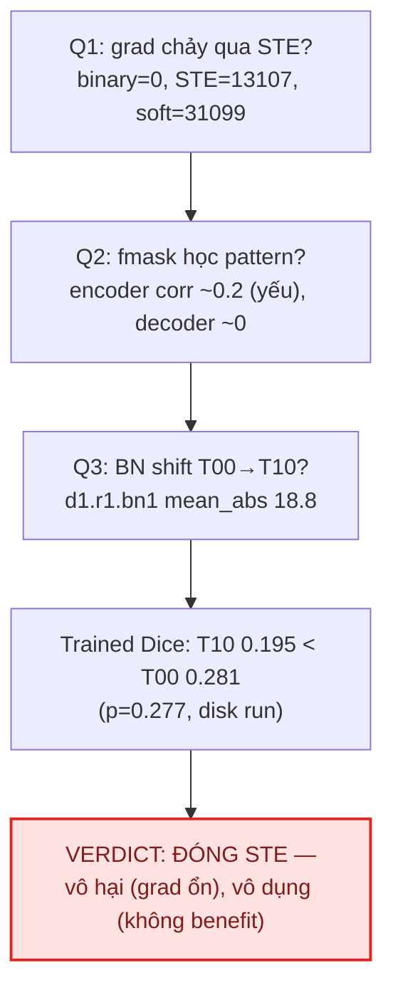

# [CN – 07/09/2026] — Phase 5: X2 Gate 0 + Gate 1 setup & X4 diagnosis

## Ký hiệu (Notation)

- `X1`–`X6`: 6 hướng nghiên cứu. `X2` = phạt false-positive ở phía loss (ưu
  tiên #1). `X4` = chẩn đoán STE bằng checkpoint có sẵn (0 GPU).
- `Gate 0` / `Gate 1` / `Gate 2`: cổng quyết định — Gate 0 = so sánh
  no-feedback vs có-feedback; Gate 1 = screening loss mới (1 seed); Gate 2 =
  multi-seed (3 seeds).
- `T00` / `T10`: cell thí nghiệm — `T` + gate (0 = binary, 1 = STE) + dual-path
  (0 = không). `T00` = baseline gốc (binary, single-path, có feedback). `T10` =
  STE, single-path. `T0N` = binary, single-path, `N` = **no-feedback** (mask = 0).
- `TA` / `TB`: cell A (loss = wIoU+wBCE+WSDice) / cell B (loss = far-weighted
  wIoU+wBCE) trong Gate 1.
- `1a` / `1b`: nhiệm vụ verify công thức loss — 1a = verify cell B (CFA-Net),
  1b = verify cell A (WSDice).
- `STE`: straight-through estimator. `BN`: BatchNorm. `fmask`: nhánh mask
  attention trong MixPool.
- `WSDice`: weighted soft dice loss. `wIoU` / `wBCE`: weighted IoU / weighted
  binary cross-entropy. `CFA-Net`: Cross-level Feature Aggregation Network
  (Pattern Recognition 2023). `F³Net`: Fusion, Feedback and Focus (AAAI 2020).
- `FP` / `FN`: false positive (dự đoán thừa) / false negative (dự đoán thiếu).
  `FP rate`: tỷ lệ pixel thừa trên ảnh — metric chính. `pp`: điểm phần trăm.
- `μ`: pixel-importance map (μ=1 trên contour, 0 vùng phẳng). `γ`: hệ số
  trọng số (γ=5 trong cell B). `CBL`: Conditional Boundary Loss (TIP 2023).

## Mục tiêu tuần này

Thực thi X2 (loss-side FP penalty) Gate 0 (T0N no-feedback) + Gate 1 (cell A
WSDice, cell B far-weighted) và X4 (chẩn đoán STE) song song theo plan cập nhật
09/05. Verify 2 công thức loss trước khi code, cài đặt + smoke-test 3 cells,
chuẩn bị notebook Kaggle phase5, chạy X4 trên CPU với checkpoints disk.

## Done

- [x] **Verify 1a** — đọc full-text CFA-Net (`1-s2.0-S0031320323002558-main.pdf`) + F³Net (`F3Net_AAAI2020.pdf`): chốt công thức pixel-weight (1+5μ) với μ theo F³Net Eq.4 (CFA-Net cite [46]=F³Net). **Kết luận: μ = |mean_3x3(GT) − GT|, μ=1 TRÊN contour, μ=0 vùng phẳng** → (1+5μ) nặng BIÊN, trái root cause FP xa biên 40.7px. **Đã báo + hỏi user → chốt: đảo thành far-weighted (1+5(1−μ))**.
- [x] **Verify 1b** — tìm công thức gốc WSDice qua paper-lookup + websearch (full text): `L=1−[2Σ(Ĝ·G)+ε]/[ΣĜ²+ΣG²+ε]`, Ĝ=w(2ŷ−1), G=w(2y−1), `w=y(v2−v1)+v1` (v2=1−v1 → w_fg=v2, w_bg=v1). **v1 không có giá trị trong paper → heuristic v1=0.3 (ghi rõ)**. `NegativeAreaDiceBCELoss` cũ ≠ bản gốc (chỉ là soft surrogate) → đổi docstring.
- [x] Implement 5 loss classes vào `src/fanet/losses.py`: `SoftIoULoss`, `IoUBCELoss`, `WeightedSoftDiceLoss` (WSDice faithful), `Phase5CellALoss`, `FarWeightedIoUBCELoss` (γ=5, wBCE normalize theo N không theo Σw để giữ trọng số ×6)
- [x] Mở rộng `scripts/train.py`: `--loss cella|farwiou`, `--no-feedback` (T0N), `--seed`
- [x] Smoke-test CPU 3 cells (1 epoch): T0N 0.785/0.755, cella 2.664/2.526, farwiou 5.286/5.531 — không crash, loss-scale đúng kỳ vọng
- [x] Tạo `notebooks/fanet_kaggle_phase5.py` + `kaggle/fanet-phase5.ipynb` (18 cells, seed 43, 3 cells T0N/TA/TB, val-Dice log mỗi epoch để bỏ phụ thuộc loss-scale)
- [x] Viết `analysis/phase5_eval.py` (protocol: T0N single-pass zero-mask; TA/TB 4-iter refinement; T00 từ `results/phase4_eval.json`; paired stats Wilcoxon/Cohen's d/bootstrap CI)
- [x] **X4 song song (CPU, checkpoints disk `checkpoints_phase4/`)** — kết quả: `results/x4_ste_diagnosis.json` + 3 figures
- [x] Viết `analysis/phase5_figures.py` (fig X4 + fig Gate 0/1 sau khi chạy)
- [ ] Chạy Kaggle phase5 (user tự submit) — **đang chờ**

## Findings quan trọng

### F1. Verify 1a — cell B theo CFA-Net là "nặng biên", KHÔNG đúng root cause (đã pivot)

| Câu hỏi | Trả lời (verify full-text) |
|---|---|
| μ là gì? | F³Net Eq.4: `μ_ij = |mean_{Aij}(GT) − GT_ij|`, Aij = cửa sổ 3×3 quanh pixel |
| μ=0 ở đâu? | Vùng PHẲNG (interior polyp + nền sâu) — xa biên |
| μ=1 ở đâu? | TRÊN contour (chuyển đổi 0↔1 trong cửa sổ) |
| (1+5μ) nặng cho ai? | **BIÊN ×6, vùng xa ×1** — ngược kỳ vọng "nhắm FP xa 40.7px" |
| Quyết định | **Đảo thành far-weighted (1+5(1−μ))** theo xác nhận của user → vùng nền sâu/interior ×6, contour ×1 |

Chi tiết thiết kế cell B: wBCE chuẩn hoá theo **N (mean)** chứ không theo Σw — nếu chia Σw thì hiệu ứng ×6 triệt tiêu vì vùng flat chiếm đa số (Σw≈6N). Đã kiểm chứng gradient: deep-bg grad FarW +0.0013 = 6× plain (+0.00022), hướng đúng (dập FP).

### F2. Verify 1b — WSDice gốc ≠ NegativeAreaDiceBCELoss cũ

```
LWSDice = 1 − [2·Σ(Ĝ·G) + ε] / [ΣĜ² + ΣG² + ε]
Ĝ = w·(2ŷ − 1) ;  G = w·(2y − 1)
w = y·(v2 − v1) + v1 ,   v2 = 1 − v1
  → w_fg = v2 = 0.7, w_bg = v1 = 0.3 (v1 heuristic, paper không cho giá trị)
```

- Đây là "soft dice" có trọng số, đưa background vào cả tử (Ĝ·G âm khi dự đoán fg trên GT-bg) → phạt FP trực tiếp.
- `NegativeAreaDiceBCELoss` hiện có (`fp_frac`) KHÔNG phải công thức gốc → giữ nhưng đổi docstring thành "FP-precision penalty (soft surrogate)". Cell A dùng `WeightedSoftDiceLoss` faithful.

### F3. X4 — chẩn đoán STE (T00 disk vs T10 disk)

| Câu hỏi | Bằng chứng | Verdict |
|---|---|---|
| STE có "gradient nhiễu" hơn soft? | Norm/var fmask-grad trên T00-weights: STE 13107/176 vs soft 31099/1032; trên T10: STE 23467/615 vs soft 40283/2052 | **KHÔNG** — STE variance THẤP HƠN soft (mọi config). Giả thuyết "STE nhiễu" không được ủng hộ |
| STE-trained fmask có học pattern khác m_fg không? | corr(fmask, GT): T00 (dead) ≈ −0.10..0.06; T10 (STE) encoder +0.13..+0.20, decoder ≈ 0 | **YẾU**: encoder có học nhẹ (corr ~0.2) nhưng decoder không; không đủ "pattern ổn định khác m_fg có ích" |
| BN distribution T00 vs T10? | diff running_mean lớn nhất: `d1.r1.bn1` mean_abs **18.76** (var 131), `e4.*` ~2-2.4, `e3.*` ~0.9 | **RẤT lớn** ở deep decoder + encoder sâu — STE dịch chuyển BN mạnh, nhất là `d1.r1.bn1` |
| Vì sao STE Dice thấp (0.195 vs 0.281) dù val loss xấp xỉ? | "val loss xấp xỉ" chỉ đúng ở NEW run (0.5590 vs 0.5611, không có checkpoint). Run DISK: T10 val **0.5674 > T00 0.5230** — tệ hơn, nhất quán với Dice thấp hơn. Thêm: eval STE == binary (no_grad), nhưng BN đã dịch chuyển mạnh → refinement trên distribution lệch | Dice gap nhất quán với val loss gap ở run disk; hiệu ứng "≈ val loss" của new run không kiểm chứng được (thiếu ckpt) |

**X4 verdict (theo stopping rule 09/04):** điều kiện "fmask học pattern ổn định khác m_fg có ích" **KHÔNG đạt** — pattern học được yếu (corr 0.2 encoder, 0 decoder) và không mang lại Dice benefit trong so sánh train duy nhất (T10 0.195 < T00 0.281, p=0.277). → **ĐÓNG STE vĩnh viễn: vô hại về gradient nhưng vô dụng; không chi GPU test lại T_A.**



### F4. Smoke-test loss-scale (để phân biệt loss-scale vs diverge)

| Cell | Train loss (ep1) | Val loss (ep1) | Ghi chú |
|---|---|---|---|
| T0N (dicebce, no-feedback) | 0.785 | 0.755 | Cùng scale T00 phase4 (0.79) |
| TA (cella) | 2.664 | 2.526 | IoU+BCE+WSDice — scale cao hơn |
| TB (farwiou) | 5.286 | 5.531 | wBCE có weight → scale cao |

→ Notebook log **val-Dice mỗi epoch** (loss-independent) để áp diverge-rule ep40 mà không bị lệch scale.

## Experiments (chạy theo plan)

| ID | Giả thuyết | Config | Kết quả | Link |
|----|-----------|--------|---------|------|
| Verify 1a | μ nặng biên hay xa biên | Đọc CFA-Net + F³Net full-text | NẶNG BIÊN → pivot far-weighted (theo user) | `docs/F3Net_AAAI2020.pdf` |
| Verify 1b | WSDice công thức gốc | Paper-lookup + websearch full-text | Chốt công thức; v1=0.3 heuristic | `src/fanet/losses.py` |
| Smoke T0N | no-feedback train chạy được | 1 epoch CPU seed43 | OK 0.785/0.755 | `logs/` (tạm, đã xóa ckpt) |
| Smoke TA/TB | loss mới chạy được | 1 epoch CPU seed43 | OK 2.66/2.53 ; 5.29/5.53 | `logs/` |
| X4 Q1 | STE gradient variance | CPU, ckpt disk, 5 batches | STE var < soft var (không nhiễu hơn) | `results/x4_ste_diagnosis.json` |
| X4 Q2 | fmask học pattern? | 8 val images | Encoder corr ~0.2 (yếu), decoder ~0 | `results/x4_ste_diagnosis.json` |
| X4 Q3 | BN shift T00 vs T10 | state_dict so sánh | d1.r1.bn1 mean_abs 18.76 — shift lớn | `results/x4_ste_diagnosis.json` |

**Gate 0 + Gate 1 — CHƯA CHẠY (user submit Kaggle):** notebook `kaggle/fanet-phase5.ipynb` đã sẵn (3 cells × 200ep, seed 43). Sau khi có checkpoint → `analysis/phase5_eval.py` → `results/phase5_eval.json` + `phase5_stats.json` → áp quyết định:

- **Gate 0**: nếu `Dice(T0N) ≥ Dice(T00)` hoặc `FP(T0N) ≤ FP(T00)` (T00 disk seed42 = 0.2806 / 4.62%) → feedback loop FANet là liability → pivot (bỏ feedback / skip-feedback FEGNet-style).
- **Gate 1**: qua nếu `FP(winner) < FP(T00) − 0.01` VÀ `Dice ≥ T00 − 0.02` VÀ `FN ≤ FN(T00) + 0.02`; so sánh thêm với T0N nếu T0N thắng T00.
- Diverge rule: val-Dice ep40 tụt mạnh so với best-so-far (log CSV) → cell fail.

## Will Do (On going)

- [ ] **User submit `kaggle/fanet-phase5.ipynb` trên Kaggle T4** (3 cells, ~3.5h×3; có thể tách session 1 = T0N)
- [ ] Download checkpoint + train_log về `checkpoints_phase5/`
- [ ] Chạy `analysis/phase5_eval.py --ckpt-dir checkpoints_phase5` → Gate 0/1 verdict
- [ ] `analysis/phase5_figures.py --eval --stats --logs` → fig Gate 0/1
- [ ] Multi-seed Gate 2 (44,45) chỉ nếu Gate 1 pass
- [ ] Nếu Gate 0/1 cho thấy feedback là liability → pivot sang no-feedback/skip-feedback (FEGNet-style soft gate + deep supervision)

## Any Stuck / Open Questions

- **Gate 0/1 pending**: không thể chạy train trên máy local (CPU ~90s/epoch → 200ep × 3 = 15h+, và plan yêu cầu Kaggle T4). User đã chọn tự submit.
- **v1 (WSDice) chưa verify**: paper không cho giá trị cụ thể trong text truy cập được; v1=0.3 là heuristic. Ghi nhận, không claim độ chính xác.
- **"STE ≈ val loss" chỉ đúng ở new run** (thiếu checkpoint) — X4 dùng run disk (có ckpt), val loss T10 tệ hơn T00 (0.567 vs 0.523). Không thể đối chiếu new-run.
- Quyết định thiết kế đã hỏi user: far-weighted (Q1), WSDice faithful (Q2), T00 disk seed42 làm baseline (Q3), user tự chạy Kaggle (Q4).

## Đính kèm link chi tiết

- Notebook: `notebooks/fanet_kaggle_phase5.py` (source) → `kaggle/fanet-phase5.ipynb`
- Loss: `src/fanet/losses.py` (SoftIoU, IoUBCE, WeightedSoftDice, Phase5CellA, FarWeightedIoUBCE)
- Train: `scripts/train.py` (`--loss cella|farwiou`, `--no-feedback`, `--seed`)
- Eval: `analysis/phase5_eval.py` — Figures: `analysis/phase5_figures.py`
- X4: `analysis/x4_ste_diagnosis.py` → `results/x4_ste_diagnosis.json`, `kaggle/figures/fig_x4_*.png`
- Report plan: `docs/reports/2026-09-05_new-papers-review.md`, `docs/reports/2026-09-04_next-directions.md`
- Literature: `docs/literature_grounding_next.md` (row 14 cập nhật WSDice verified)
- Template: `docs/reports/_TEMPLATE.md` — Index: `docs/reports/README.md`