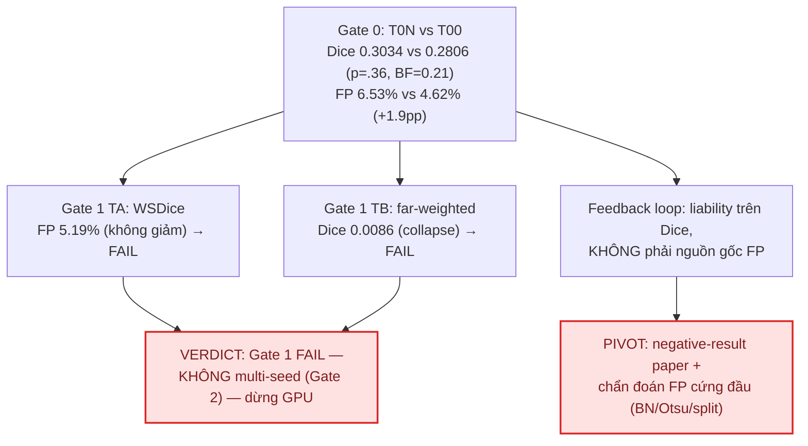

# [CN – 08/09/2026] — Phase 5: KẾT QUẢ Gate 0/1 (loss-side FP penalty)

## Ký hiệu (Notation)

- `T00`: baseline binary (feedback, train 200ep, seed 42) — reference từ Phase 4 disk.
- `T0N`: mô hình **no-feedback** (mask = 0, không vòng phản hồi, seed 43).
- `TA` / `TB`: cell A = loss kết hợp WSDice (v1=0.3) / cell B = far-weighted
  wIoU+wBCE (γ=5) — đều giữ vòng feedback, seed 43.
- `Gate 0` / `Gate 1`: cổng quyết định — no-feedback vs có-feedback / screening loss 1 seed.
- `STE`: straight-through estimator · `BN`: BatchNorm · `fmask`: nhánh attention MixPool.
- `wIoU` / `wBCE`: weighted IoU / weighted BCE · `WSDice`: weighted soft dice.
- `FP` / `FN`: false positive / false negative · `pp`: điểm phần trăm.
- Các test thống kê: Wilcoxon signed-rank (paired), rank-biserial r, bootstrap 95% CI,
  Shapiro-Wilk (kiểm định giả định). Ngưỡng Bonferroni pre-registered α = 0.0083.

## Mục tiêu

Chốt verdict cho **X2 (loss-side FP penalty)** — hướng ưu tiên #1 sau audit 04/09:
(1) Gate 0: feedback loop có phải gánh nặng không (T0N vs T00)? (2) Gate 1: loss phạt FP
có giảm FP ≥1pp mà giữ Dice không (TA/TB vs T00)? Kaggle T4 đã chạy xong → download
checkpoint, eval trên 40 ảnh val, phân tích thống kê chuẩn, ra phán quyết theo stopping rule.

## Done

- [x] Download output kernel `namnguynnnn/fanet-phase5` → `kaggle/outputs_phase5/` (3 ckpt + 3 train_log + kernel log + data)
- [x] Copy ckpt/log về `checkpoints_phase5/`
- [x] Xác nhận training hoàn tất: T0N/TA/TB × 200 epochs, seed 43, GPU Tesla T4 (kernel status COMPLETE)
- [x] Chạy `analysis/phase5_eval.py` → `results/phase5_eval.json`, `results/phase5_stats.json`
- [x] Chạy `analysis/phase5_figures.py` → 4 figures Gate 0/1 (`kaggle/figures/fig_p5_*.png`)
- [x] Phân tích thống kê chuẩn (descriptives + assumption + effect size + sensitivity + Bayes) → `results/phase5_stats_full.json` (`analysis/phase5_stats_full.py`)
- [x] Viết verdict Gate 0/1 + pivot theo stopping rule

## Findings quan trọng

### F1. Training hoàn tất nhưng 3 model rất khác nhau

| Cell | Loss | best val loss | best valDice (train, soft) |
|---|---|---|---|
| T0N | dicebce, no-feedback | 0.5512 | 0.2339 |
| TA | cella (WSDice) | 1.6560 | 0.2350 |
| TB | farwiou (γ=5) | 2.4780 | 0.1949 |

Nguồn: `kaggle/outputs_phase5/fanet-phase5.log`, `checkpoints_phase5/train_log_*.csv`.
Lưu ý: valDice trong train là **soft dice (không cắt ngưỡng)** → có thể che giấu collapse ở binary eval.

### F2. Eval: Bảng kết quả cuối (iter 4, 40 ảnh val)

| Cell | Dice | IoU | FP% | FN% | Precision | Recall |
|---|---|---:|---:|---:|---:|---:|
| T00 (reference, seed42) | 0.2806 | 0.1955 | 4.62 | 6.30 | — | — |
| **T0N** (no-feedback) | **0.3034** | 0.1974 | **6.53** | 5.98 | 0.4231 | 0.4431 |
| **TA** (WSDice) | 0.2853 | 0.1905 | 5.19 | 6.32 | 0.3501 | 0.4225 |
| **TB** (far-weighted) | **0.0086** | 0.0044 | **0.05** | **8.59** | 0.2582 | **0.0047** |

Nguồn: `results/phase5_eval.json`. Figures: `kaggle/figures/fig_p5_final_metrics.png`.

### F3. Paired stats vs T00 (Wilcoxon + effect size + CI)

| Cell | ΔDice | p (Wilcoxon) | rank-biserial r | Bootstrap 95% CI (ΔDice) | n_pos/40 | ΔFP (pp) | p (ΔFP) | ΔFN (pp) |
|---|---|---|---|---:|---|---:|---:|---:|---:|
| T0N | **+0.0228** | .357 | 0.563 | [−0.048, +0.092] | 23 | **+1.91** | .155 | −0.31 |
| TA | +0.0048 | .712 | 0.146 | [−0.096, +0.107] | 22 | +0.57 | .400 | +0.03 |
| TB | **−0.2719** | **<.001** | — | [−0.357, −0.193] | 3 | **−4.57** | **<.001** | +2.29 |

- **Assumption check (Shapiro-Wilk trên paired deltas):** Dice-delta chuẩn cho T0N
  (W=0.957, p=.131) và TA (W=0.966, p=.261); TB vi phạm (W=0.886, p<.001 — do collapse).
  FP-delta vi phạm chuẩn cho T0N (p<.001) và TB (p<.001) → dùng Wilcoxon là đúng.
- **Effect size:** r = 0.563 (T0N) là hiệu ứng LỚN theo quy ước, nhưng CI bao gồm 0 và
  BF10 = 0.205 → **bằng chứng ủng hộ null** (không có khác biệt thực chất về Dice).
- **Sensitivity (n=40):** chỉ phát hiện được d ≥ 0.45 (80% power, α=.05); cần n=34 cho
  d=0.5, n=90 cho d=0.3 → mọi claim Dice < 0.1 hiện KHÔNG đủ sức mạnh thống kê.
- **Bayes (T0N vs T00):** BF10 = 0.205 (ủng hộ null ≈ 4.9:1), P(mean ΔDice > 0) = 0.735
  (yếu) → không thể khẳng định "no-feedback tốt hơn Dice".

Nguồn: `results/phase5_stats.json`, `results/phase5_stats_full.json`.

### F4. Gate 0 — VERDICT: feedback loop = liability (Dice), NHƯNG không giải quyết FP

Criterion pre-registered (report 09/07): `Dice(T0N) ≥ Dice(T00)` **hoặc** `FP(T0N) ≤ FP(T00)`
→ feedback là liability.

- Dice leg: T0N 0.3034 ≥ T00 0.2806 → **TRUE** → formal verdict = **feedback loop là liability**.
- FP leg: T0N 6.53% > T00 4.62% → **FALSE** (no-feedback làm FP TĂNG +1.91pp).

→ **Kết luận tinh tế:** bỏ feedback không hại Dice (thậm chí nhích lên, không significant),
NHƯNG cũng KHÔNG dọn được over-segmentation — root cause vẫn nguyên. Feedback mask-at-input
có tác dụng "prune" nhẹ FP ở inference (T00 FP thấp hơn T0N), nhưng không giúp Dice.

### F5. Gate 1 — VERDICT: FAIL (cả 2 loss-side cell)

Criterion pre-registered (report 09/04, 09/07): pass nếu `FP(winner) < FP(T00) − 0.01`
VÀ `Dice ≥ T00 − 0.02` VÀ `FN ≤ FN(T00) + 0.02`.

| Cell | FP cần < 3.62%? | Dice cần ≥ 0.2606? | FN cần ≤ 8.30%? | Verdict |
|---|---|---|---|---|
| TA (WSDice) | ❌ 5.19% | ✅ 0.2853 | ✅ 6.32% | **FAIL** (FP không giảm) |
| TB (far-weighted) | ✅ 0.05% | ❌ **0.0086** (collapse) | ❌ 8.59% | **FAIL** (Dice sụp) |

→ **Gate 1 FAILS. KHÔNG chạy Gate 2 (multi-seed).** Stopping rule 09/04 kích hoạt.

### F6. Cơ chế thất bại của từng loss

- **TB (far-weighted, γ=5) — COLLAPSE:** trọng số (1+5(1−μ)) đặt ×6 lên vùng PHẲNG
  (interior polyp + nền sâu) để dập FP. Với γ=5, mô hình chọn "dự đoán gần như toàn
  background" để né phạt FP → recall 0.0047, FP 0.05% (đạt mục tiêu FP nhưng vô nghĩa).
  Quan trọng: **soft dice khi train (~0.19) che giấu collapse** — chỉ lộ ra khi binary
  eval cắt ngưỡng 0.5. Đây là bài học methodology cho việc theo dõi loss-side.
- **TA (WSDice, v1=0.3):** w_fg=0.7, w_bg=0.3 — chênh lệch quá nhỏ để tạo phạt FP đáng kể
  → kết quả ≈ baseline (Dice +0.005, FP +0.57pp). Không đủ mạnh, không đủ hại.
- **T0N (no-feedback):** Dice nhỉnh hơn nhưng không significant (BF ủng hộ null); FP tăng
  → feedback loop không giúp Dice nhưng cũng không phải nguồn gốc của FP.

### F7. Verdict tổng (theo stopping rule 09/04)

## Experiments

| ID | Giả thuyết | Config | Kết quả | Link log |
|----|-----------|--------|---------|----------|
| Gate 0 | Bỏ feedback không hại Dice và giảm FP | T0N (no-feedback) vs T00 (feedback) | Dice T0N cao hơn (+0.023, p=.36, BF=0.21 → null); FP TĂNG +1.91pp | `results/phase5_eval.json`, `phase5_stats_full.json` |
| Gate 1 TA | WSDice giảm FP ≥1pp, giữ Dice | loss cella, seed 43, 200ep | FAIL: FP 5.19% (không giảm), Dice 0.2853 | `checkpoints_phase5/train_log_TA.csv` |
| Gate 1 TB | far-weighted giảm FP ≥1pp, giữ Dice | loss farwiou γ=5, seed 43, 200ep | FAIL: FP 0.05% nhưng Dice COLLAPSE 0.0086 (recall 0.0047) | `checkpoints_phase5/train_log_TB.csv` |
| Bayes T0N vs T00 | Xác định hướng khác biệt Dice | BF10 paired | BF10 = 0.205 → ủng hộ null (~4.9:1) | `results/phase5_stats_full.json` |
| Sensitivity | δ nhỏ nhất detect được | n=40, α=.05, power .80 | d ≥ 0.45; cần n=34 (d=.5), n=90 (d=.3) | `results/phase5_stats_full.json` |

## Will Do (On going)

- [ ] **PIVOT theo stopping rule 09/04**: dừng chi GPU cho X2; chuyển sang
  (a) chẩn đoán tại sao FP cứng đầu (BN stats, Otsu init, đặc thù split 156/40), hoặc
  (b) **reframe paper thành negative-result + phân tích confounder/bug có hệ thống**
  (chuẩn Metrics Reloaded) — vẫn publish được.
- [ ] Ghi rõ bài học: **soft-dice khi train che giấu collapse** → mọi cell loss-side sau
  này phải có binary val-dice theo dõi, không chỉ loss-scale.
- [ ] So sánh chính thức trong paper: feedback loop là liability trên Dice (Gate 0),
  nhưng FP tăng khi bỏ feedback → cần kết luận "mask-at-input không có lợi, cũng không
  là nguồn gốc FP".
- [ ] Cập nhật research overview + README index với verdict Phase 5.
- [ ] (Tùy chọn) Cân nhắc Gate 2 baseline multi-seed (X5) để củng cố nền cho negative-result
  claim — chỉ nếu cần power cho viết paper.

## Any Stuck / Open Questions

- **TB soft-dice train 0.19 nhưng binary eval 0.0086**: xác nhận collapse do trọng số
  far-weighted quá mạnh (γ=5), không phải bug checkpoint (3 ckpt cùng kiến trúc, load
  đúng, eval protocol giống Phase 4). Không cần chạy lại.
- **Gate 0 chưa dứt khoát**: Dice leg pass nhưng không significant (p=.36; BF=0.21);
  FP leg fail. Kết luận an toàn: "không có bằng chứng feedback giúp Dice; feedback không
  phải nguồn gốc FP". Tránh claim "feedback có hại" dạng tuyệt đối.
- **Nguồn gốc FP vẫn chưa bị can thiệp thành công** sau 2 hướng (cơ chế + loss) → giữ
  câu hỏi mở cho paper: "vì sao over-segmentation của FANet cứng đầu với cả feedback
  lẫn loss-side penalty".

## Đính kèm link chi tiết

- Kernel Kaggle: `namnguynnnn/fanet-phase5` (status COMPLETE 08/09 04:59) — log: `kaggle/outputs_phase5/fanet-phase5.log`
- Checkpoints + train log: `checkpoints_phase5/` (T0N/TA/TB)
- Eval: `results/phase5_eval.json`, `results/phase5_stats.json` — Stats full: `results/phase5_stats_full.json`
- Scripts: `analysis/phase5_eval.py`, `analysis/phase5_stats_full.py`, `analysis/phase5_figures.py`
- Figures: `kaggle/figures/fig_p5_final_metrics.png`, `fig_p5_paired_delta_{T0N,TA,TB}.png`, `fig_p5_train_curves.png`
- Plan/stopping rules: `docs/reports/2026-09-04_next-directions.md`, `docs/reports/2026-09-07_phase5-x2-gate01.md`
- Template: `docs/reports/_TEMPLATE.md` — Index: `docs/reports/README.md`