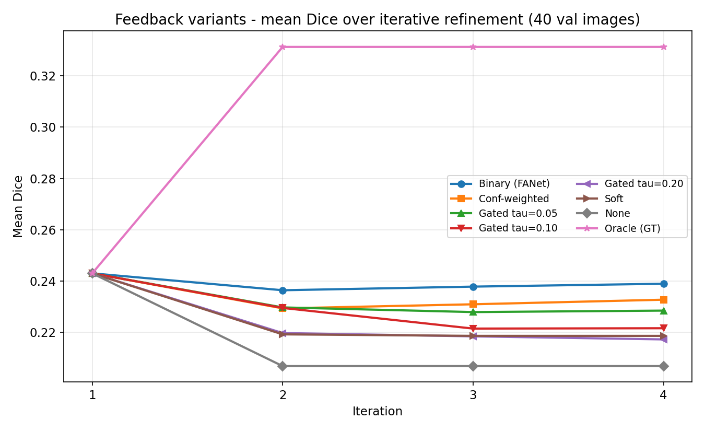
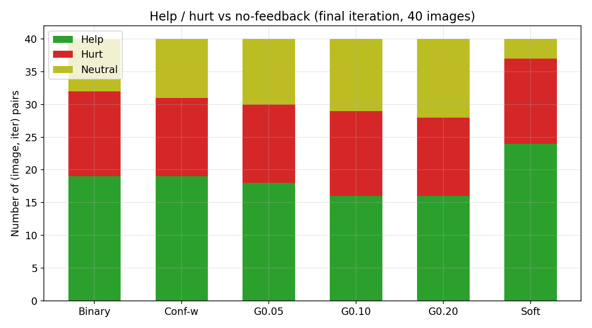
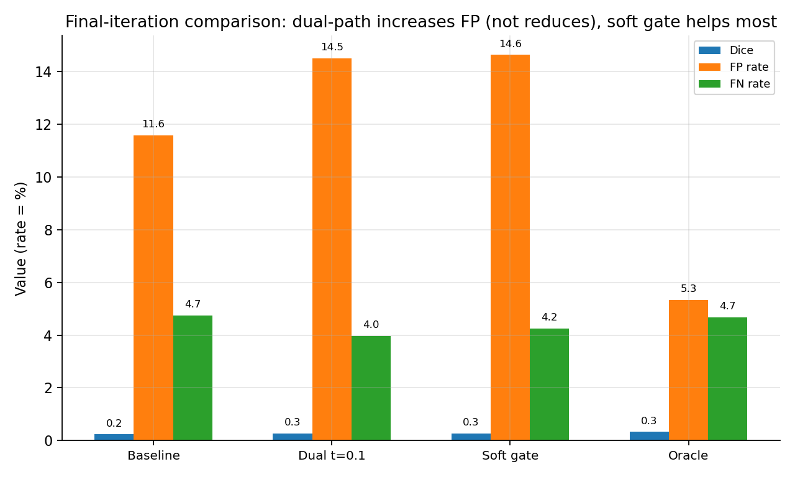
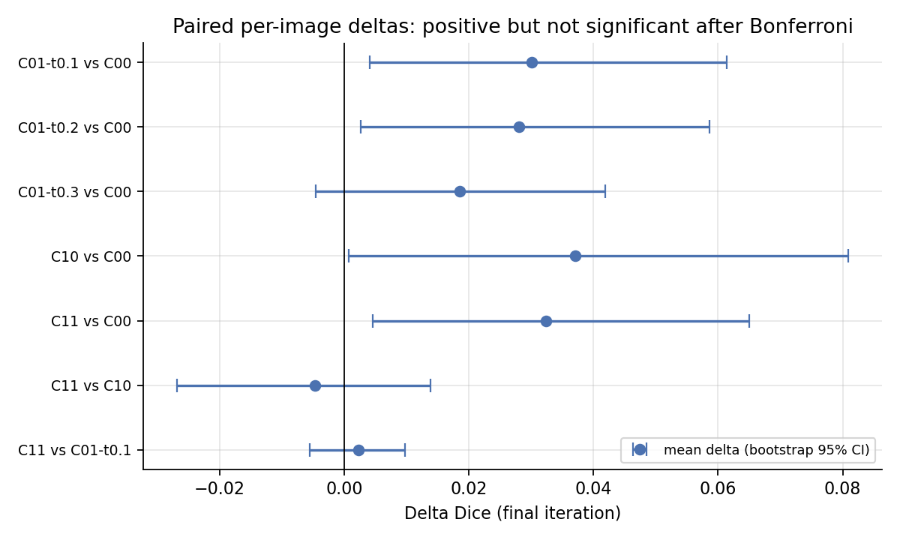
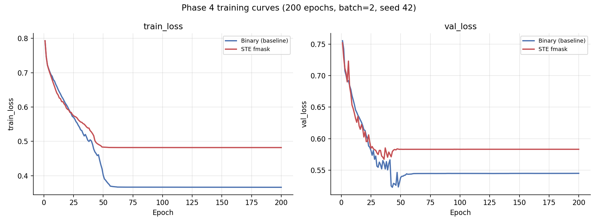
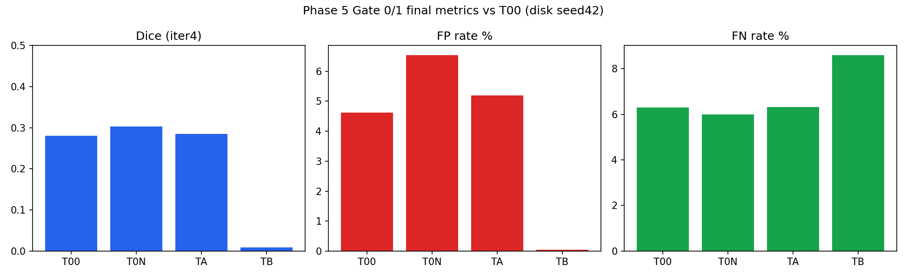
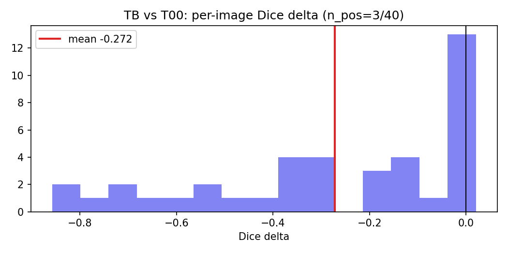

# Báo cáo Tổng quan Nghiên cứu FANet

**Dự án:** FANet — Reproduction + Cải tiến cho phân đoạn ảnh y sinh
**Ngày:** 08/09/2026
**Đối tượng đọc:** Người mới, chưa biết gì về dự án và lĩnh vực.
**Mục đích:** Giúp bạn hiểu **tổng quát** — dự án này làm gì, tại sao làm, tìm ra
điều gì, và định hướng tiếp theo ra sao — để dùng cho slide thuyết trình và lên kế
hoạch viết bài báo.

---

## PHẦN A. Bối cảnh: Dự án này giải quyết bài toán gì?

### A.1. Phân đoạn ảnh y sinh là gì?

Trong y tế, bác sĩ cần nhìn ảnh chụp (ví dụ ảnh **nội soi đại tràng**) và xác định
chính xác **vùng bất thường** — điển hình là **polyp** (khối u nhỏ ở thành ruột,
tiền thân của ung thư đại tràng). Việc **khoanh vùng** polyp trên ảnh được gọi là
**phân đoạn ảnh** (segmentation).

- **Foreground (vùng cần tìm):** polyp.
- **Background (nền):** phần còn lại — niêm mạc ruột, dịch, bóng sáng...
- **Mask (mặt nạ):** kết quả phân đoạn. Là một ảnh đen-trắng cùng kích thước ảnh gốc,
  pixel trắng (1) = polyp, pixel đen (0) = nền.

> **Vì sao quan trọng?** Polyp dễ bị bỏ sót hoặc khoanh sai. Một mô hình máy tính tự
> động khoanh polyp chính xác giúp bác sĩ nội soi nhanh và ít sót hơn.

### A.2. Mô hình phân đoạn "học" như thế nào?

- **Mạng nơ-ron encoder-decoder (kiểu U-Net):** mạng gồm 2 nửa. **Encoder** nén ảnh
  thành "đặc trưng" (hiểu ảnh nói gì), **decoder** phóng to trở lại thành mask.
  Đây là kiến trúc tiêu chuẩn cho phân đoạn.
- **Đầu ra:** với mỗi pixel, mô hình cho một **xác suất** từ 0 đến 1 (mức độ tin là
  polyp). Muốn thành mask nhị phân (0/1) thì phải **cắt ngưỡng** (ví dụ xác suất > 0.5
  coi là polyp).
- **Loss function (hàm mất mát):** công thức đo "mô hình sai bao nhiêu so với đáp án
  đúng (ground truth)". Mô hình **học bằng cách giảm loss** qua nhiều vòng lặp (epoch).
- **Dice / IoU:** hai cách đo độ trùng khớp giữa mask dự đoán và mask đúng, giá trị
  gần 1 = rất khớp, gần 0 = sai. Đây là thước đo chất lượng chuẩn.
- **FP (false positive) / FN (false negative):** FP = mô hình vẽ thừa vùng không phải
  polyp; FN = mô hình bỏ sót vùng là polyp. **Over-segmentation** = mô hình vẽ quá
  rộng (nhiều FP).

### A.3. Dữ liệu dự án dùng

- **Kvasir-SEG:** bộ ảnh polyp nội soi công khai nổi tiếng (1000 ảnh).
- Dự án dùng **tập con sessile** (196 ảnh, chia 156 train / 40 val) để chạy thử trên
  máy thường trước khi chạy lớn trên GPU đám mây.

---

## PHẦN B. Paper gốc FANet — Ý tưởng, Ưu điểm, Hạn chế

> FANet (Feedback Attention Network, IEEE TNNLS 2022) là **paper gốc** dự án này
> tái hiện và cải tiến.

### B.1. Ý tưởng chính của FANet

Mô hình phân đoạn thông thường **quên hết** những gì nó dự đoán ở lần trước. FANet
đặt câu hỏi: *"Sao không dùng mask dự đoán cũ làm gợi ý cho lần dự đoán tiếp?"*

Cơ chế của FANet:
1. Ở mỗi vòng lặp, mô hình nhận **ảnh gốc + mask của lần dự đoán trước** (gọi là
   **feedback mask**).
2. Feedback mask đóng vai **hard attention**: nó "chỉ đạo" mô hình chỉ tập trung vào
   vùng đã được cho là polyp, **tỉa bỏ** phần còn lại.
3. Nhờ vậy tạo thành **vòng phản hồi xuyên vòng lặp** — dự đoán càng ngày càng tốt
   hơn (cả khi huấn luyện lẫn khi suy luận).

Bộ phận làm việc này có tên **MixPool**: nó cắt tỉa feature theo mask, nhưng giữ lại
50% feature gốc như "phao cứu sinh" phòng khi mask sai.

### B.2. Ưu điểm của FANet

| Ưu điểm | Giải thích đơn giản | Bằng chứng (file) |
|---|---|---|
| Ý tưởng mới lạ | Hướng "tái dùng dự đoán cũ" là hiếm, mở ra cả một nhánh nghiên cứu | `docs/literature_grounding_next.md` (FANetv2, FEGNet trích dẫn) |
| Mô hình nhẹ | ~7.7 triệu tham số, chạy được cả trên CPU thường | `logs/report_log.txt` (script `scripts/report.py`) |
| Có cơ chế tinh chỉnh lúc kiểm tra | Khi mô hình đã tốt, lặp lại vài lần giúp kết quả khớp hơn | `results/test_results.csv` (checkpoint 53ep: F1 0.315→0.327) |
| Được cộng đồng dùng làm điểm so sánh | Nhiều bài báo sau trích dẫn và so sánh với FANet | `docs/literature_grounding_next.md` (32 paper curated) |

### B.3. Hạn chế của FANet (đã được dự án kiểm chứng bằng dữ liệu)

Dự án này không chỉ đọc lý thuyết mà còn **chạy thật và đo đạc** để tìm ra điểm yếu.
Hai điểm yếu cấu trúc quan trọng nhất:

**1. Nhánh "attention tự học" thực chất chưa bao giờ được học.**
Trong MixPool có một nhánh nhỏ được quảng cáo là "tự học cách chú ý". Nhưng cách viết
dùng phép so sánh cứng (`giá trị > 0.5`), và phép so sánh này **không cho đạo hàm** —
nghĩa là mô hình **không thể học** từ nhánh đó. Nói cách khác, nhánh "thông minh"
thực chất là **ngẫu nhiên**, mọi sức mạnh đến từ feedback mask.

**Bằng chứng (Hạn chế 1 — nhánh attention không học):**
- `logs/analysis_grad_log.txt` (script `analysis/grad_flow.py`) → sau 10 steps training,
  **0/160** tham số nhánh attention có gradient (nhánh conv bên cạnh đủ 160/160); trọng
  số không đổi sau `optimizer.step()`; sau **53 vòng lặp**, BN affine sai lệch so khởi
  tạo = **0.0000** (chỉ có thể xảy ra nếu nhánh chưa từng được update).


**2. Feedback vứt bỏ thông tin quan trọng.**
Feedback mask chỉ là ảnh đen-trắng (1/0), nên nó **vứt bỏ độ chắc chắn** (mô hình tự
tin 99% hay chỉ 51% — bị đối xử như nhau) và **vứt bỏ cả vùng nền**. Hệ quả: khi mô
hình **vẽ thừa** (over-segment), feedback sẽ **khuếch đại lỗi thừa đó** thay vì sửa.

**Bằng chứng (Hạn chế 2 — feedback quá thô):**
- `results/feedback_uncertainty_bins.csv`, `logs/feedback_analysis_log.txt` → pixel tin
  <0.1 sai **48.7%**, pixel tin >0.35 chỉ sai **2.7%** — nhưng threshold 0.5 đối xử
  hai loại này như nhau (hình dưới).
- `results/oracle_summary.json` → feedback không chứa thông tin nền: **84.6%** dư địa
  oracle nằm ở vùng model vẽ thừa; FP/FN = 2.48; FP cách biên 40.7px → feedback
  khuếch đại lỗi vẽ thừa thay vì sửa.


> **Một câu tóm tắt:** FANet có ý tưởng hay nhưng có **2 khiếm khuyết kỹ thuật** —
> (1) cơ chế "tự học" chết ngay từ đầu, (2) feedback quá thô (bỏ độ chắc chắn và
> bỏ thông tin nền).

---

## PHẦN C. Các nghiên cứu liên quan (bối cảnh thế giới)

Dự án đã đọc và tổng hợp **32 bài báo liên quan** để biết người khác đã làm gì và
chỗ nào còn trống.

### C.1. Các hướng nghiên cứu chính

| Hướng | Đại diện | Làm gì |
|---|---|---|
| Feedback mask | FANetv2 (2025, cùng nhóm tác giả FANet) | Làm tiếp ý tưởng FANet, thêm text-guiding và tinh chỉnh lúc test |
| Feedback dùng "lỗi dự đoán" | Predictive coding polyp (2026) | Dùng sai số dự đoán làm tín hiệu phản hồi khi suy luận |
| Feedback bên trong mạng | FEGNet, RefineU-Net | Không nhét mask vào đầu vào mà để các tầng tự phản hồi nhau (mềm, có học được) |
| Chú ý ngược (reverse attention) | PraNet, UACANet | Dùng vùng "1 − dự đoán" (tức vùng không phải polyp) để tự sửa lỗi vẽ thừa |
| Đổi hàm mất mát | WSDice, Lovász, Tversky; và 5/7 bài polyp dùng wIoU+wBCE | Phạt lỗi "vẽ thừa" ngay trong công thức học, không đổi mạng |

### C.2. Bài học rút ra từ so sánh

- **Người khác làm "feedback" thành công là feedback MỀM bên trong mạng**, còn FANet
  nhét mask cứng vào đầu vào — đây là khác biệt cốt lõi.
- **Hướng "phạt lỗi vẽ thừa từ hàm mất mát" là hướng rẻ và phổ biến**, nhưng **FANet
  gốc chưa bao giờ dùng** — đây là "lỗ hổng" dự án nhắm tới.
- Ý tưởng "đưa kênh nền tường minh vào feedback" (hướng dự án từng đề xuất) **vẫn
  chưa ai làm**, nhưng rủi ro cao và có 2 bài báo cạnh tranh gần kề → chỉ nên dùng
  làm phần phụ, không nên đặt cược cả bài báo vào đó.

---

## PHẦN D. Hành trình nghiên cứu của dự án (kể theo trình tự)

> Đây là phần kể chuyện — mỗi bước làm gì, tìm ra gì. **Mỗi kết luận đều kèm
> "Bằng chứng"** (biểu đồ + file số liệu) để bạn hoặc người phản biện có thể tự kiểm
> chứng. Các con số được tóm tắt trong PHẦN E.

### D.1. Bước 0 — Chạy lại FANet (10/08/2026)

- Cài môi trường, **tái hiện** (reproduce) FANet trên tập sessile: 53 vòng lặp, độ
  lỗi val giảm về 0.505. Mô hình chạy ổn định.
- Viết tài liệu mô tả kiến trúc để hiểu tường tận.

### D.2. Bước 1 — Tìm ra 2 điểm yếu cấu trúc (20–24/08/2026)

- So sánh FANet với UACANet (bài báo có cách xử lý thông tin mềm hơn) → chỉ ra FANet
  mất 6 loại thông tin.
- **Đo gradient** (dòng chảy của việc "học") → xác nhận **điểm yếu 1**: nhánh attention
  không học được gì.
- **Đo mức độ chắc chắn** → xác nhận **điểm yếu 2**: feedback cứng làm sai lệch vùng
  không chắc chắn. Cụ thể: pixel mà mô hình tin < 0.1 có tỉ lệ sai **48.7%**, còn pixel
  tin > 0.35 chỉ sai **2.7%** — nhưng feedback đối xử hai loại này như nhau.

**Bằng chứng (Điểm yếu 1 — nhánh attention không học được):**
- `logs/analysis_grad_log.txt` → sau 10 steps: **0/160** tham số nhánh attention có
  gradient; BN affine sai lệch so khởi tạo = **0.0000** sau 53 vòng. Script: `analysis/grad_flow.py`.

**Bằng chứng (Điểm yếu 2 — feedback vứt độ chắc chắn):**


- `results/feedback_uncertainty_bins.csv`, `logs/feedback_analysis_log.txt` → error rate
  48.7% (conf < 0.1) vs 2.7% (conf > 0.35); FP tập trung ở vùng conf thấp.

### D.3. Bước 2 — Thử cải tiến theo hướng "feedback" (27/08 – 04/09/2026)

Đặt ra 2 câu hỏi và **kiểm định bằng thí nghiệm**:

**Thử nghiệm 1 — Confidence-gating:** "Nếu feedback chỉ giữ vùng tự tin cao thì có
giảm lỗi không?" → Chạy 9 biến thể. **Kết quả: KHÔNG.** Feedback nhị phân nguyên bản
vẫn tốt nhất. Lý do sâu xa: vùng mô hình "không tự tin" chính là vùng biên polyp —
vừa là nơi dễ sai, vừa là nơi cần được hướng dẫn nhất. Cắt lỗi = cắt luôn thông tin
hữu ích.

**Bằng chứng (Thử nghiệm 1 — confidence-gating):**





- `results/confgated_summary.json`, `logs/confgated_log.txt` → binary 0.2390 là cao
  nhất; gated càng mạnh (tau càng cao) càng tệ; soft giúp nhiều case nhất (24) nhưng
  mean delta thấp (+0.0118).

**Thử nghiệm 2 — Dual-path (kênh nền tường minh):** "Nếu thêm thông tin nền vào
feedback thì có dọn được lỗi vẽ thừa không?" → **Kết quả (đo trên mô hình cũ): KHÔNG.**
Lỗi vẽ thừa còn **tăng** (+2.9 điểm phần trăm, p rất nhỏ). Khi train lại từ đầu,
mô hình dual-path **không ổn định** (2 lần chạy đều xấu hơn hoặc sụp). → Hướng này
không đáng đầu tư tiếp.

**Bằng chứng (Thử nghiệm 2 — dual-path):**





- `results/abl2x2_stats.json`, `logs/abl2x2_log.txt` → dual-path FP **+2.92pp**
  (p=1.27e-7), negative control làm Dice sụp 0.239→0.083 (hiệu ứng là do thông tin
  nền thật, không phải do "thêm kênh").

**Thử nghiệm 3 — Hồi sinh nhánh attention:** "Nếu sửa phép so sánh cứng để nhánh
attention học được thì sao?" → Kỹ thuật STE giúp gradient chảy được (điều kiện cần
đạt). Nhưng **train lại: kết quả KÉM hơn** (Dice 0.195 so với 0.281 của baseline).
Chẩn đoán sâu: STE không làm mô hình học được gì có ích (chỉ hơi học ở encoder, không
ở decoder; làm phân phối của BatchNorm lệch nặng). → **Kết luận: đóng vĩnh viễn hướng này.**

**Bằng chứng (Thử nghiệm 3 — STE):**




- `results/phase4_eval.json`, `results/phase4_stats.json` → baseline 0.2806 vs STE 0.1951
  (delta −0.0855, p=0.277, 20/40 ảnh binary thắng).
- `results/x4_ste_diagnosis.json` → STE gradient variance thấp hơn soft; fmask học yếu
  (encoder corr ~0.2, decoder ~0); BatchNorm dịch chuyển mạnh (`d1.r1.bn1` mean_abs 18.8)
  → đóng STE vĩnh viễn ("vô hại-vô dụng").

### D.4. Bước 3 — Tìm ra GỐC RỄ vấn đề (31/08/2026)

Làm thí nghiệm **oracle**: tưởng tượng feedback không phải do mô hình đoán mà là
**đáp án đúng hoàn hảo** (ground truth). So sánh "feedback đúng hoàn hảo" vs "feedback
mô hình tự đoán" → biết mô hình đang thiếu thông tin gì.

**Kết quả:**
- Mô hình **vẽ thừa gấp 2.48 lần vẽ thiếu** (FP/FN = 2.48).
- **84.6%** chỗ khác nhau giữa hai loại feedback nằm ở vùng mô hình **vẽ thừa**.
- Lỗi vẽ thừa nằm **xa biên polyp 40.7 pixel** (tràn sâu vào nền), lỗi vẽ thiếu chỉ
  **8.6 pixel** (sát biên).

**Bằng chứng (Gốc rễ — oracle):**


- `results/oracle_summary.json`, `results/oracle_analysis.csv`, `logs/oracle_analysis_log.txt`
  → FP/FN = 2.48; 84.6% khác biệt ở vùng vẽ thừa; FP cách biên 40.7px, FN 8.6px;
  oracle gap +0.093 ổn định.
- Figures liên quan: `fig5_kept_fraction.png` (phần foreground giữ lại theo biến thể).

> **Kết luận gốc rễ (root cause):** vấn đề chính của FANet là **vẽ thừa vùng nền**,
> và cơ chế feedback hiện tại **không hề biết cách dọn vùng nền** vì nó chỉ biết đến
> polyp chứ không biết đến nền.

### D.5. Bước 4 — Xoay hướng sang hàm mất mát (04–07/09/2026)

Ba hướng "động vào cơ chế feedback" đều thất bại (D.3). Gốc rễ là **vẽ thừa** mà
**chưa bao giờ bị phạt từ hàm mất mát**. Thế giới đã chứng minh cách này hiệu quả
(5/7 bài polyp dùng wIoU+wBCE). → **Xoay hướng (pivot):** phạt lỗi vẽ thừa ngay trong
loss, không đổi kiến trúc.

Công việc đã làm:
- Đọc full-text để **xác minh công thức** 2 loại loss mới (WSDice, far-weighted
  wIoU+wBCE) — tránh dùng sai công thức.
- Viết code 5 loại loss + train script, **chạy thử** (smoke test) trên CPU: hoạt động
  đúng, không crash.
- Chuẩn bị notebook chạy trên GPU đám mây (Kaggle) với 3 mô hình: không-feedback,
  loss WSDice, loss far-weighted.

### D.6. Bước 5 — Thí nghiệm cuối (loss-side): KẾT QUẢ (08/09/2026)

**Đã chạy xong trên Kaggle (GPU T4, 3 mô hình × 200 vòng, seed 43).** Kết quả theo
quy trình quyết định 3 bậc (Gate 0/1):

- **Gate 0 (có nên bỏ feedback?):** Mô hình **không-feedback** đạt Dice 0.3034 ≥ mô hình
  có-feedback 0.2806 → theo quy tắc đã đăng ký, **vòng feedback là gánh nặng trên Dice**
  (nhưng khác biệt KHÔNG có ý nghĩa thống kê, p=0.36; bằng chứng Bayes ủng hộ "không khác
  biệt"). Quan trọng: bỏ feedback làm **FP TĂNG (+1.9 điểm phần trăm)** → feedback không
  phải nguồn gốc của lỗi vẽ thừa.
- **Gate 1 (loss phạt vẽ thừa có giúp?):** **CẢ 2 loại loss đều THẤT BẠI.**
  - Loss **WSDice**: không giảm được FP (FP 5.19% vs 4.62% baseline).
  - Loss **far-weighted** (nặng vùng nền): giảm FP mạnh (0.05%) nhưng **Dice sụp về
    0.0086** — mô hình học "đoán toàn background" để né phạt → vô nghĩa. Lưu ý: trong
    lúc train, soft-dice (~0.19) che giấu sự sụp đổ này — chỉ lộ ra khi đánh giá bằng
    ngưỡng nhị phân. Đây là bài học methodology.
- **Phán quyết (theo stopping rule):** **Gate 1 FAIL → KHÔNG chạy multi-seed, dừng đốt
  GPU cho hướng loss-side.** Chuyển hướng sang viết **negative-result paper** + chẩn
  đoán vì sao FP "cứng đầu" (xem PHẦN F.3).

**Bằng chứng (Phase 5 — Gate 0/1):**





- `results/phase5_eval.json`, `results/phase5_stats.json`, `results/phase5_stats_full.json`
  → T0N Dice 0.3034 vs T00 0.2806 (p=.36, BF10=0.21 ủng hộ null, FP +1.91pp); TA FP 5.19%
  (không giảm); TB Dice 0.0086 (recall 0.0047).
- `checkpoints_phase5/train_log_*.csv` + `kaggle/figures/fig_p5_train_curves.png` →
  TB soft-dice lúc train ~0.19 nhưng binary eval sụp → **soft-dice che giấu collapse**.
- Kernel log: `kaggle/outputs_phase5/fanet-phase5.log` (200 epochs × 3 cells, seed 43).

> **Tổng kết toàn hành trình:** 5 hướng cải tiến đã thử (confidence-gating, dual-path,
> STE, WSDice, far-weighted) — **tất cả đều thất bại có kiểm soát**, mỗi cái có số liệu
> và lý do rõ ràng. Giá trị khoa học nằm ở chính **khung phân tích negative-result
> chuẩn mực** này, không phải ở một cơ chế "hack" số.

---

## PHẦN E. Kết quả chính (bảng tóm tắt — giải thích bằng lời)

| Câu hỏi | Kết quả đo được | Nói bằng lời đơn giản | Độ tin cậy | Bằng chứng (file) |
|---|---|---|---|---|
| Nhánh "tự học" của FANet có học không? | Sai lệch trọng số sau 53 vòng = 0.0000; 0/160 tham số có gradient | **KHÔNG học được gì** — chết ngay từ đầu | Chắc chắn (đo trực tiếp) | `logs/analysis_grad_log.txt`, `analysis/grad_flow.py` |
| Vùng không tự tin có lỗi cao không? | Pixel tin <0.1 sai 48.7%; tin >0.35 sai 2.7% | **Có** — độ chắc chắn dự báo được lỗi | Chắc chắn | `results/feedback_uncertainty_bins.csv` + hình `fig3_uncertainty_error.png` |
| Cắt vùng không tự tin khỏi feedback giúp không? | Feedback nhị phân cũ tốt nhất (0.2390) | **KHÔNG giúp** — cắt lỗi = cắt luôn thông tin biên | Trung bình (đo trên mô hình cũ) | `results/confgated_summary.json` + hình `fig1_variant_dice.png`, `fig2_help_hurt.png` |
| Feedback dự đoán thiếu gì so với "đúng hoàn hảo"? | 84.6% khác biệt ở vùng vẽ thừa; vẽ thừa gấp 2.48 lần vẽ thiếu; xa biên 40.7px | **Thiếu hiểu biết về nền** — gốc rễ là vẽ thừa vùng nền xa | Chắc chắn (đo pixel) | `results/oracle_summary.json` + hình `fig_abl_oracle_gap.png` |
| Thêm kênh nền vào feedback giúp không? | Lỗi vẽ thừa TĂNG +2.9pp (p=1e-7); train lại không ổn định | **KHÔNG giúp** | Trung bình | `results/abl2x2_stats.json` + hình `fig_abl_final_metrics.png`, `fig_abl_stats.png` |
| Sửa nhánh attention (STE) giúp không? | Baseline 0.281 vs STE 0.195 | **KHÔNG giúp, còn kém** → đóng hướng | Trung bình (1 seed) | `results/phase4_eval.json`, `results/x4_ste_diagnosis.json` + hình `fig_p4_train_curves.png`, `fig_x4_fmask_corr.png` |
| Mô hình baseline mới đạt bao nhiêu? | Dice 0.2806, IoU 0.1955 | Đây là điểm chuẩn (baseline) để so sánh mọi thứ sau | Chắc chắn (train đủ) | `results/phase4_eval.json` |
| Còn bao nhiêu "dư địa" để cải thiện? | Oracle đạt 0.331–0.370 (cao hơn baseline ~0.09) | Có khoảng trống thật, chủ yếu ở việc dọn vùng nền | Trung bình | `results/oracle_summary.json`, `results/confgated_summary.json` |
| **Bỏ feedback hẳn có tốt hơn không? (Gate 0)** | Không-feedback Dice 0.3034 ≥ feedback 0.2806; **nhưng FP tăng +1.9pp**; p=0.36 (không ý nghĩa) | **Feedback là gánh nặng trên Dice** nhưng KHÔNG phải nguồn gốc lỗi vẽ thừa | Trung bình (1 seed) | `results/phase5_eval.json`, `results/phase5_stats_full.json` + hình `fig_p5_final_metrics.png` |
| **Loss WSDice có dọn lỗi vẽ thừa? (Gate 1)** | FP 5.19% vs baseline 4.62% (không giảm) | **KHÔNG** — không giảm được FP | Trung bình (1 seed) | `results/phase5_eval.json` + `checkpoints_phase5/train_log_TA.csv` |
| **Loss far-weighted (nặng nền)? (Gate 1)** | FP 0.05% nhưng **Dice sụp 0.0086** (mô hình đoán toàn nền) | **THẤT BẠI** — giảm FP vô nghĩa vì không còn dự đoán được polyp | Trung bình (1 seed; collapse rõ) | `results/phase5_eval.json` + hình `fig_p5_paired_delta_TB.png`, `fig_p5_train_curves.png` |

> **Bản chất của cả hành trình:** dự án thử **5 hướng cải tiến** (confidence-gating,
> dual-path, STE, WSDice, far-weighted) — **tất cả đều thất bại một cách trung thực**
> (có số liệu, có lý do, có stopping rule). Nhưng thất bại này **định vị chính xác gốc
> rễ vấn đề** (vẽ thừa vùng nền, kháng cự cả cơ chế feedback lẫn loss-side) và dẫn tới
> một bài báo negative-result chuẩn mực — đây chính là giá trị khoa học của dự án.

---

## PHẦN F. Định hướng bài báo và việc cần làm

### F.1. Đóng góp mới (Novelty) có thể cho bài báo

| # | Đóng góp | Khả thi | Giải thích ngắn |
|---|---|---|---|
| 1 | **Phân tích phủ định có hệ thống** | **Cao (đã đủ dữ liệu)** | Chỉ rõ **5 hướng cải tiến thất bại và vì sao** — đúng chuẩn "negative result" khoa học, vẫn publish được |
| 2 | **Phát hiện chẩn đoán**: nhánh "tự học" của FANet là non-differentiable (không học được) | Cao | Phát hiện mới, có bằng chứng đo trực tiếp, giá trị cho cộng đồng tái hiện FANet |
| 3 | **Phát hiện: soft-dice lúc train che giấu collapse** (TB) — bài học methodology | Cao | Phát hiện mới từ Phase 5; khuyến nghị theo dõi binary val-dice khi dùng loss-side |
| 4 | **Định vị dư địa** bằng oracle (84.6% nằm ở vùng vẽ thừa, xa biên 40.7px) | Cao | Phân tích hướng thiết kế, đã có dữ liệu |

**Chiến lược (đã chốt sau Phase 5):** hướng loss-side **thất bại** (Gate 1 FAIL) →
bài báo theo **negative-result chuẩn mực** (đóng góp 1+2+3+4): tổng hợp 5 hướng thất
bại có kiểm soát + khung chẩn đoán/bug-tracking chặt chẽ — đủ để publish ở các venue
chấp nhận reproducibility/negative-result.

### F.2. Dàn ý bài báo (sơ bộ)

```
1. Giới thiệu — vì sao cần phân đoạn polyp; feedback-attention là gì; khoảng trống.
2. Nghiên cứu liên quan — feedback, reverse attention, loss functions.
3. Phương pháp — FANet baseline, khung chẩn đoán, cải tiến đề xuất.
4. Thí nghiệm — dữ liệu, cách đo, kết quả từng bước.
5. Kết quả & thảo luận — bảng số liệu, vì sao feedback-at-input không hiệu quả,
   đâu là dư địa thật, hạn chế.
6. Kết luận & hướng tương lai.
```

### F.3. Việc cần làm tiếp theo (đã cập nhật sau kết quả Phase 5)

| Ưu tiên | Việc | Điều kiện |
|---|---|---|
| 1 | ✅ **Đã xong: thí nghiệm loss-side trên Kaggle** (3 mô hình × 200 vòng) | Đã chạy, Gate 1 FAIL |
| 2 | ✅ **Đã xong: đánh giá quy trình 3 bậc** — (a) feedback là gánh nặng trên Dice nhưng không phải nguồn gốc FP; (b) loss mới không giảm FP (WSDice) hoặc sụp Dice (far-weighted); (c) **KHÔNG chạy multi-seed** vì Gate 1 fail | — |
| 3 | **Pivot sang negative-result paper**: tổng hợp 5 hướng thất bại có kiểm soát + khung phân tích/bug-tracking + stats chuẩn (Wilcoxon, effect size, CI, Bayes, sensitivity) | Chính là dữ liệu hiện có |
| 4 | **Chẩn đoán vì sao FP "cứng đầu"** (BN stats, Otsu init, đặc thù split 156/40) — câu hỏi mở cho paper | Không tốn GPU |
| 5 | Hoàn thiện bài báo (phân tích + tái lập + reproducibility appendix) | Song song |
| 6 | (Tùy chọn) baseline multi-seed để củng cố nền thống kê cho claim negative | Chỉ khi cần power cho viết paper |

**Đã quyết định bỏ/hoãn:** hướng STE (đóng vĩnh viễn), hướng kênh nền tường minh
(prior thấp), các loss chỉ chữa biên (không chữa đúng gốc rễ vẽ thừa vùng nền xa),
**hướng loss-side FP penalty (WSDice/far-weighted) — Gate 1 FAIL, đóng sau Phase 5**.

---

## PHẦN G. Từ điển thuật ngữ (dành cho người mới)

| Thuật ngữ | Nghĩa đơn giản |
|---|---|
| **Polyp** | Khối u nhỏ ở thành ruột, cần phát hiện sớm trong nội soi |
| **Segmentation / phân đoạn** | Khoanh vùng từng pixel trong ảnh (ở đây: tô đúng vùng polyp) |
| **Mask** | Ảnh đen-trắng đánh dấu vùng polyp (trắng = polyp) |
| **Foreground / Background** | Vùng cần tìm / vùng nền |
| **Ground truth** | Đáp án đúng (bác sĩ vẽ) để mô hình học và được chấm điểm |
| **Encoder-decoder (U-Net)** | Kiến trúc mạng: nén ảnh thành đặc trưng rồi phóng to thành mask |
| **Attention** | Cơ chế "tập trung" vào vùng quan trọng |
| **Feedback mask** | Mask của lần dự đoán trước, đưa lại làm gợi ý cho lần sau |
| **Hard threshold / nhị phân hóa** | Biến xác suất (0–1) thành 0 hoặc 1 (cắt tại 0.5) |
| **Loss function** | Công thức đo độ sai; mô hình học = giảm loss |
| **Epoch** | Một vòng lặp qua toàn bộ dữ liệu train |
| **Dice / IoU** | Điểm đo độ khớp giữa dự đoán và đáp án (1 = khớp hoàn toàn) |
| **FP (vẽ thừa) / FN (vẽ thiếu)** | Dự đoán sai kiểu thừa / kiểu thiếu |
| **Over-segmentation** | Vẽ quá rộng — quá nhiều FP |
| **STE (straight-through estimator)** | Kỹ thuật cho phép gradient "xuyên qua" phép so sánh cứng (một cách gượng ép) |
| **Oracle** | Tình huống "thí nghiệm lý tưởng": feedback = đáp án đúng hoàn hảo |
| **Confidence / uncertainty** | Mức độ tự tin của mô hình về một pixel |
| **Seed / hạt giống** | Số khởi tạo ngẫu nhiên — chạy nhiều seed để kiểm tra kết quả có ổn định không |
| **wIoU / wBCE / WSDice** | Các loại loss có trọng số — phạt vùng quan trọng hơn |
| **Pivot** | Chuyển hướng nghiên cứu dựa trên bằng chứng |

---

## PHẦN H. Nguồn dữ liệu trong repo (để bạn biết tìm ở đâu khi cần)

> Đọc tổng quan thì không cần các file này, nhưng nếu cần kiểm chứng số liệu:
> - **Tài liệu mô tả kiến trúc FANet:** `docs/FANet_Complete_Guide.md`
> - **Danh sách bài báo liên quan (32 bài):** `docs/literature_grounding_next.md`
> - **Báo cáo chi tiết từng giai đoạn:** `docs/reports/` (mở `README.md` để xem mục lục)
> - **Biểu đồ bằng chứng (tất cả kết luận ở trên):** `kaggle/figures/` (fig1..fig5 = confidence/uncertainty,
>   fig_abl_* = ablation 2×2, fig_p4_* = train end-to-end, fig_x4_* = chẩn đoán STE,
>   fig_p5_* = Phase 5 Gate 0/1)
> - **Số liệu kết quả:** thư mục `results/` (JSON/CSV) — Phase 5: `phase5_eval.json`, `phase5_stats.json`, `phase5_stats_full.json`
> - **Nhật ký chạy:** thư mục `logs/` + `kaggle/outputs_phase5/fanet-phase5.log`
> - **Mô hình đã train:** thư mục `checkpoints/`, `checkpoints_phase4/`, `checkpoints_phase5/`
> - **Mã nguồn:** `src/fanet/`, `scripts/`, `analysis/`