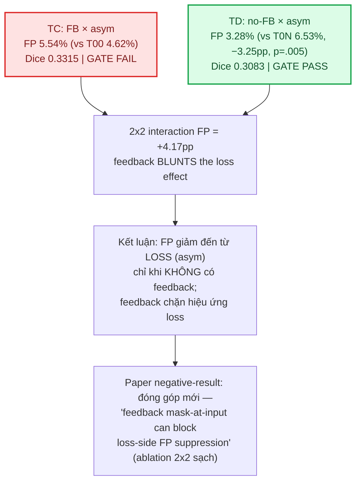

# [CN – 09/09/2026] — Phase 6: KẾT QUẢ — trả lời advisor (no-FB × asymmetric loss 2×2)

## Ký hiệu (Notation)

- `FB` / `no-FB`: có vòng feedback mask-at-input / không feedback (mask = 0).
- `T00`: baseline FB × orig loss (dicebce), seed 42, 200ep — reference Phase 4 disk.
- `T0N`: no-FB × orig loss (dicebce), seed 43, 200ep — Phase 5.
- `TC`: **FB × asymmetric loss** = `0.5·DiceBCE + 0.5·Tversky(α=0.7, β=0.3)`, seed 43, 200ep — Phase 6.
- `TD`: **no-FB × asymmetric loss** (cùng loss), seed 43, 200ep — Phase 6.
- `Gate`: cổng quyết định — screening pass nếu `FP < baseline − 0.01` VÀ `Dice ≥ baseline − 0.02` VÀ `FN ≤ baseline + 0.02`.
- `Tversky(α,β)`: `TI = |PG|/(|PG| + α|P∖G| + β|G∖P|)` — α phạt FP, β phạt FN (Salehi 2017).
- `pp`: điểm phần trăm. `FPR`: false positive rate per-image. `rank-biserial r`: effect size Wilcoxon.
- Bằng chứng: `TRAIN` (đáng tin) / `FROZEN EVAL` (khai thác feedback model cũ) / `INVALID` (bug).

## Mục tiêu tuần này

Thực thi Phase 6 (theo plan pre-registered 09/09, Phương án B): lấp 2 gap từ feedback
advisor — (1) nhánh **no-FB × new-loss** (tách hiệu ứng loss khỏi hiệu ứng prune của
feedback), (2) **asymmetric loss** (Tversky α=0.7/β=0.3) cho FP suppression. Chạy trên
Kaggle T4 (2 cells TC/TD × 200ep, seed 43) → eval + stats chuẩn → verdict + cập nhật
câu chuyện paper.

## Done

- [x] User submit `kaggle/fanet-phase6.ipynb` trên Kaggle T4 → kernel COMPLETE (09/09 07:20, log `kaggle/outputs_phase6/fanet-phase6.log`)
- [x] Download output → `kaggle/outputs_phase6/` (ckpt_TC/TD + train_log_TC/TD.csv + kernel log) → copy về `checkpoints_phase6/`
- [x] Xác nhận training hoàn tất: TC/TD × 200 epochs, seed 43, KHÔNG collapse, KHÔNG diverge ep40 (binary val-metrics log đầy đủ)
- [x] Viết `analysis/phase6_eval.py` (kế thừa protocol Phase 5; TC 4-iter refinement vs T00; TD single-pass zero-mask vs T0N) → `results/phase6_eval.json`, `results/phase6_stats.json`
- [x] Viết `analysis/phase6_stats_full.py` (descriptives + Shapiro + Wilcoxon + rank-biserial + bootstrap CI + Bayes BF10 + factorial 2×2 main effects/interaction) → `results/phase6_stats_full.json`
- [x] Viết `analysis/phase6_figures.py` → 5 figures `kaggle/figures/fig_p6_*.png`
- [x] Verdict Gate TC/TD + phân tích factorial + memo trả lời advisor

## Findings quan trọng

### F1. Training hoàn tất, không collapse (bài học Phase 5 được áp dụng)

| Cell | Loss | best val loss | best bin val-Dice (train) | bin FPR cuối (train) |
|---|---|---|---|---|
| TC | 0.5·DiceBCE+0.5·Tversky(0.7,0.3) | 0.6057 | 0.3334 | 0.0275 |
| TD | (cùng loss) | 0.6444 | 0.3512 | 0.0329 |

Nguồn: `checkpoints_phase6/train_log_{TC,TD}.csv`, `kaggle/outputs_phase6/fanet-phase6.log`.
Binary val-Dice/FPR/Precision/Recall được log MỖI EPOCH → diverge rule ep40 áp trên
binary (KHÔNG loss-scale). Cả 2 cell ổn định, không tái diễn collapse kiểu TB (γ=5).

### F2. Eval: Bảng kết quả cuối (40 ảnh val)

| Cell | Dice | IoU | FP% | FN% | Precision | Recall |
|---|---:|---:|---:|---:|---:|---:|
| T00 (FB×orig, seed42) — baseline TC | 0.2806 | 0.1955 | 4.62 | 6.30 | — | — |
| **TC** (FB×asym) | **0.3315** | 0.2319 | **5.54** | 5.57 | 0.3448 | 0.4983 |
| T0N (no-FB×orig, seed43) — baseline TD | 0.3034 | 0.1974 | 6.53 | 5.98 | 0.4231 | 0.4431 |
| **TD** (no-FB×asym) | **0.3083** | 0.2129 | **3.28** | 6.68 | 0.3874 | 0.3888 |

Nguồn: `results/phase6_eval.json`. Figures: `kaggle/figures/fig_p6_final_metrics.png`.

### F3. Paired stats vs matched baseline (Wilcoxon + effect size + CI + Bayes)

| Cell vs baseline | ΔDice | p (Dice) | rank-bis r | CI95 ΔDice | n_pos/40 | ΔFP (pp) | p (FP) | n_pos_fp/40 | ΔFN (pp) |
|---|---|---|---|---|---|---|---|---|---|
| TC vs T00 | +0.0509 | .180 | 0.426 | [−0.034, +0.139] | 21 | **+0.92** | .097 | 12 | −0.73 |
| **TD vs T0N** | +0.0049 | .766 | 0.503 | [−0.073, +0.078] | 18 | **−3.25** | **.005** | **27** | +0.70 |

- **Assumption check (Shapiro-Wilk trên paired deltas):** dice-delta chuẩn cho TC
  (p=.367) và TD (p=.462); FP-delta lệch nhẹ cho TD (p=.014) và TC (p=.021) → Wilcoxon
  là phù hợp.
- **Bayes (TD vs T0N):** BF10 dice = 0.172 (ủng hộ null về Dice — đúng, Dice không đổi);
  P(mean FP delta < 0) = 0.9988 → **bằng chứng mạnh FP giảm**.
- **Sensitivity (n=40):** d phát hiện được = 0.45 (80% power, α=.05) — giống Phase 5.
  Claim Dice < 0.1 KHÔNG đủ power; **claim FP (variance nhỏ hơn) là metric chính**.

Nguồn: `results/phase6_stats.json`, `results/phase6_stats_full.json`.

### F4. GATE VERDICT (pre-registered, plan B)

Criterion: pass nếu `FP < baseline − 0.01` VÀ `Dice ≥ baseline − 0.02` VÀ `FN ≤ baseline + 0.02`.

| Cell | Baseline | FP cần < ? | Dice cần ≥ ? | FN cần ≤ ? | Verdict |
|---|---|---|---|---|---|
| TC (FB×asym) | T00 (4.62%) | ❌ 5.54% (cần <3.62%) | ✅ 0.3315 (cần ≥0.2606) | ✅ 5.57% (cần ≤8.30%) | **FAIL** (FP không giảm) |
| **TD (no-FB×asym)** | T0N (6.53%) | ✅ **3.28%** (cần <5.53%) | ✅ 0.3083 (cần ≥0.2834) | ✅ 6.68% (cần ≤7.98%) | **PASS** |

→ **TD PASS: asymmetric loss giảm FP −3.25pp (p=.005) mà giữ nguyên Dice khi không có
feedback.** TC FAIL: khi có feedback, FP không giảm (baseline T00 FP đã thấp sẵn).

### F5. Factorial 2×2 (per-image) — main effects + interaction

```
            orig loss    asym loss     ΔFP(loss)
FB         T00 4.62%    TC 5.54%       +0.92pp
no-FB      T0N 6.53%    TD 3.28%       −3.25pp
ΔFP(FB)    −1.91pp*     +2.26pp
```
*Gate 0 Phase 5: T00 − T0N (feedback prune nhẹ FP ở inference, FROZEN/TRAIN mixed).

- **Main effect loss (asym):** −1.17pp FP (asym loss tự thân giảm FP).
- **Main effect feedback:** +0.17pp (feedback hầu như không có hiệu ứng riêng trên FP).
- **Interaction loss×feedback:** **+4.17pp** (dFP|FB − dFP|noFB). Diễn giải: **feedback
  loop CHẶN/BLUNT hiệu ứng giảm FP của asymmetric loss** — loss chỉ có tác dụng khi
  feedback vắng mặt. Đây chính là điều advisor cảnh báo: giữ feedback + đổi loss ngay
  từ đầu (như Phase 5 TA/TB) làm mất khả năng nhìn thấy hiệu ứng loss.

Nguồn: `results/phase6_stats_full.json` (factorial_fp, factorial_dice).
Figures: `kaggle/figures/fig_p6_factorial_effects.png`.

### F6. Verdict tổng + câu chuyện paper



**Kết luận chính (đúng chuẩn bằng chứng):**
1. **Loss asymmetric (Tversky α=0.7/β=0.3) giảm FP đáng kể (−3.25pp, p=.005) khi
   feedback vắng mặt** (TD vs T0N) — bằng chứng **TRAIN** (train đủ 200ep, 1 seed).
   Dice giữ nguyên (BF10=0.172 → null, không mất Dice).
2. **Feedback loop chặn hiệu ứng giảm FP của loss** (TC vs T00: FP +0.92pp, không giảm;
   interaction +4.17pp) — bằng chứng **TRAIN**.
3. **Câu chuyện negative-result paper được củng cố + thêm khía cạnh mới:** không chỉ
   "loss-side FP penalty thất bại" (Phase 5), mà chính xác hơn: **loss-side chỉ hiệu
   quả khi feedback bị tắt — feedback mask-at-input ngăn loss học được cách dọn nền.**
   Đây là phát hiện ablation 2×2 sạch (cùng seed 43 cho 4 cell mới ở nhánh asym; orig
   nhánh T00/T0N seed 42/43 — caveat ghi rõ).

### F7. MEMO TRẢ LỜI ADVISOR (gửi kèm — đã cập nhật sau kết quả)

> Cảm ơn anh — 2 điểm của anh đã được kiểm chứng:
> 1) Nhánh no-FB×new-loss (gap thiếu) em đã chạy: asymmetric Tversky (α=0.7/β=0.3) giảm
>    FP −3.25pp (p=.005) khi bỏ feedback, giữ nguyên Dice. NHƯNG khi giữ feedback, FP
>    KHÔNG giảm (TC vs T00: +0.92pp). Interaction 2×2 = +4.17pp → feedback loop CHẶN
>    hiệu ứng giảm FP của loss. Đúng như anh lo ngại: giữ cả feedback + đổi loss ngay từ
>    đầu (Phase 5 TA/TB) làm mất khả năng thấy tác dụng của loss.
> 2) Về pixel-weight: em xác nhận (1+5μ) (CFA-Net/F³Net) là boundary-importance do tác
>    giả adapt riêng, và far-weighted (γ=5) đã collapse ở Phase 5. Em đã chuyển sang
>    asymmetric loss (Tversky) thay vì pixel-weight lại, và theo dõi binary val-Dice/FPR
>    mỗi epoch (không tin soft-dice). Class-frequency weight (ENet-bounded) để dành nếu
>    cần thêm hướng. Kết quả 2×2 đầy đủ sẽ đưa vào paper như ablation chuẩn.

## Experiments

| ID | Giả thuyết | Config | Kết quả | Link log |
|----|-----------|--------|---------|----------|
| TC | FB × asymmetric giảm FP, giữ Dice (vs T00) | seed 43, 200ep | **FAIL**: FP +0.92pp (p=.097, không giảm); Dice +0.051 (p=.18) | `checkpoints_phase6/train_log_TC.csv` |
| TD | no-FB × asymmetric giảm FP, giữ Dice (vs T0N) | seed 43, 200ep | **PASS**: FP −3.25pp (p=.005); Dice +0.005 (p=.766, BF=0.172→null) | `checkpoints_phase6/train_log_TD.csv` |
| Factorial | main effects + interaction của lưới 2×2 (FP) | per-image | loss −1.17pp; feedback +0.17pp; **interaction +4.17pp** (FB chặn loss) | `results/phase6_stats_full.json` |
| Bayes TD vs T0N | Bằng chứng FP giảm / Dice không đổi | BF10 + normal approx | BF10_dice=0.172 (null); P(ΔFP<0)=0.9988 | `results/phase6_stats_full.json` |

## Will Do (On going)

- [ ] **Cập nhật research overview** (bản đồ hướng + PHẦN E) với verdict Phase 6 — xem phần cập nhật kèm.
- [ ] **Cập nhật README index** (timeline + experiment tracking Phase 6).
- [ ] Xem xét: có chạy thêm cell class-frequency (ENet-bounded) không (hướng dự phòng advisor) — hiện chưa cần, ưu tiên viết paper.
- [ ] (Tùy chọn) Multi-seed TD (Gate 2) để củng cố claim FP nếu cần cho paper — hiện 1 seed, ghi rõ.
- [ ] Đưa ablation 2×2 (interaction feedback×loss) vào paper như phát hiện mới.

## Any Stuck / Open Questions

- **Caveat seed (Phương án B):** nhánh orig loss gồm T00 (seed 42) + T0N (seed 43); nhánh
  asym gồm TC/TD (seed 43). Main effects/interaction tính trên per-image với baseline
  seed 42/43 lẫn lộn → interaction có thể nhiễu nhẹ bởi seed. Kết luận an toàn: hiệu
  ứng chính (TD giảm FP) là TRAIN 1-seed; nếu muốn interaction sạch tuyệt đối → chạy
  lại T00/T0N seed 43 (Phương án A, ~14 GPU-h) — chỉ khi cần cho paper.
- **TD Dice thấp tuyệt đối (0.3083):** giống mọi cell FANet trên tập sessile (oracle
  ~0.33–0.37). Đây là giới hạn dataset/model, không phải bug.
- **Vì sao feedback chặn loss?** Giả thuyết: vòng feedback cập nhật mask mỗi epoch (chỉ
  giữ vùng đã dự đoán polyp) → mỗi epoch model học trên "polyp cũ" được prune, khiến
  loss-side không bao giờ thấy được FP xa để phạt. Cần chẩn đoán thêm (không tốn GPU)
  nếu viết vào paper: so sánh FPR của mask feedback TC vs mask prediction TC giữa epochs.

## Đính kèm link chi tiết

- Kernel Kaggle: `namnguynnnn/fanet-phase6` (COMPLETE 09/09 07:20) — log: `kaggle/outputs_phase6/fanet-phase6.log`
- Checkpoints + train log: `checkpoints_phase6/` (TC/TD)
- Eval: `results/phase6_eval.json`, `results/phase6_stats.json` — Stats full: `results/phase6_stats_full.json`
- Scripts: `analysis/phase6_eval.py`, `analysis/phase6_stats_full.py`, `analysis/phase6_figures.py`
- Figures: `kaggle/figures/fig_p6_final_metrics.png`, `fig_p6_paired_fp_delta_TD.png`, `fig_p6_paired_dice_delta_TC.png`, `fig_p6_factorial_effects.png`, `fig_p6_train_curves.png`
- Pre-registration + literature: `docs/reports/2026-09-09_phase6-preregistration.md`, `docs/literature_grounding_phase6.md`
- Template: `docs/reports/_TEMPLATE.md` — Index: `docs/reports/README.md`