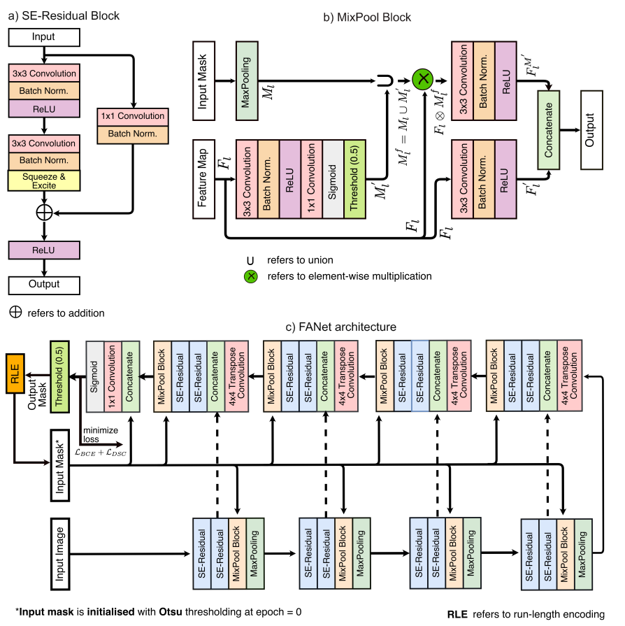
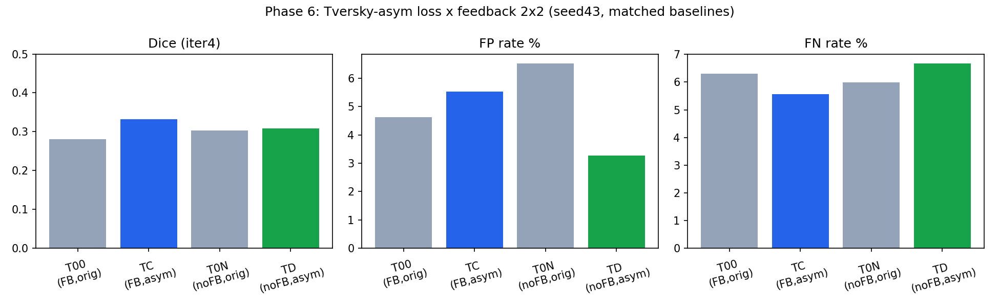
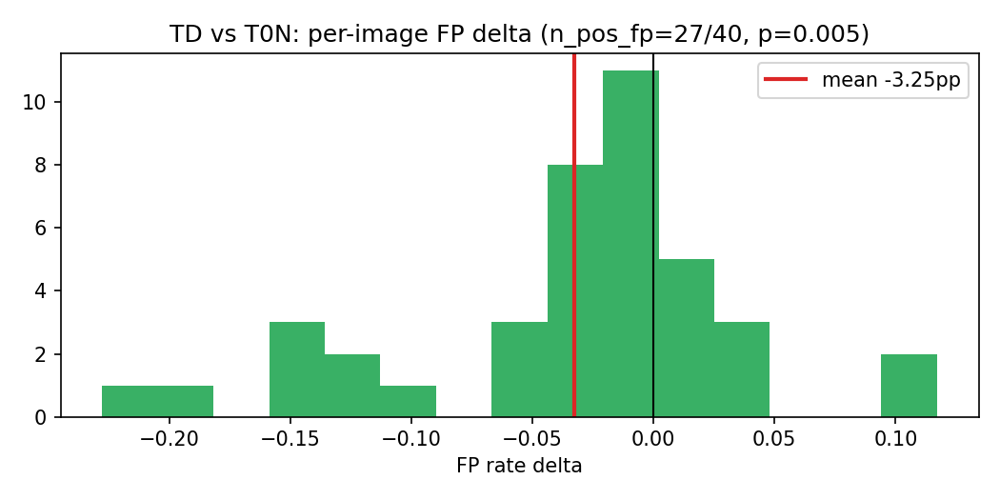
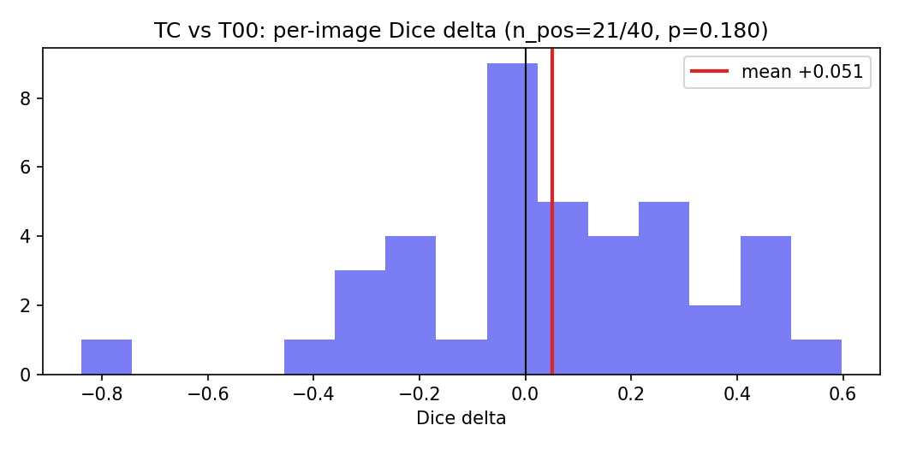
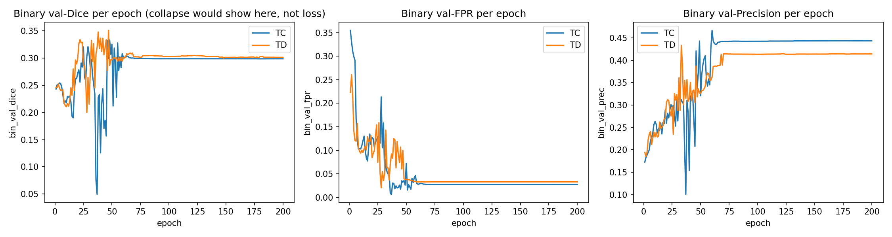
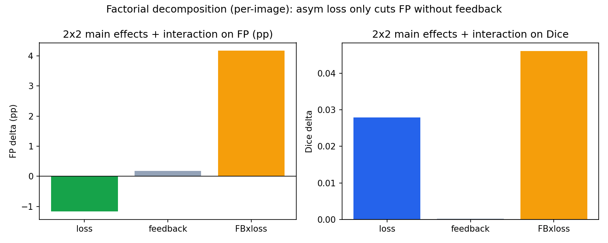
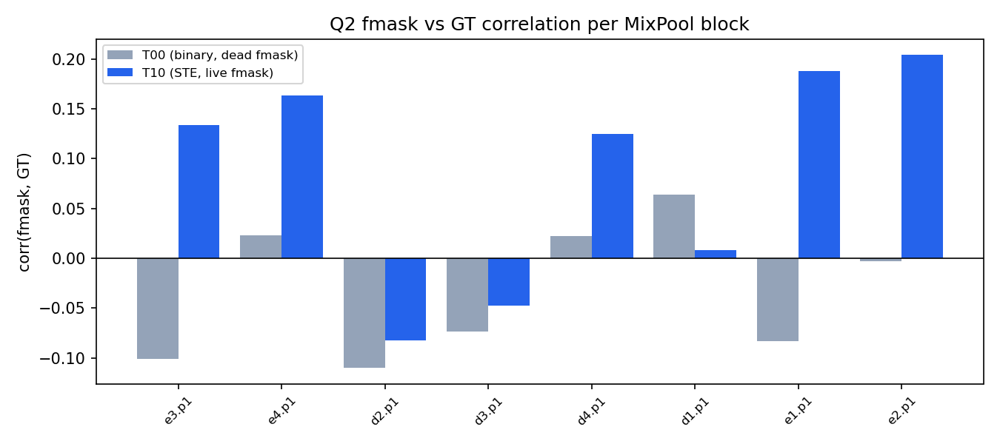
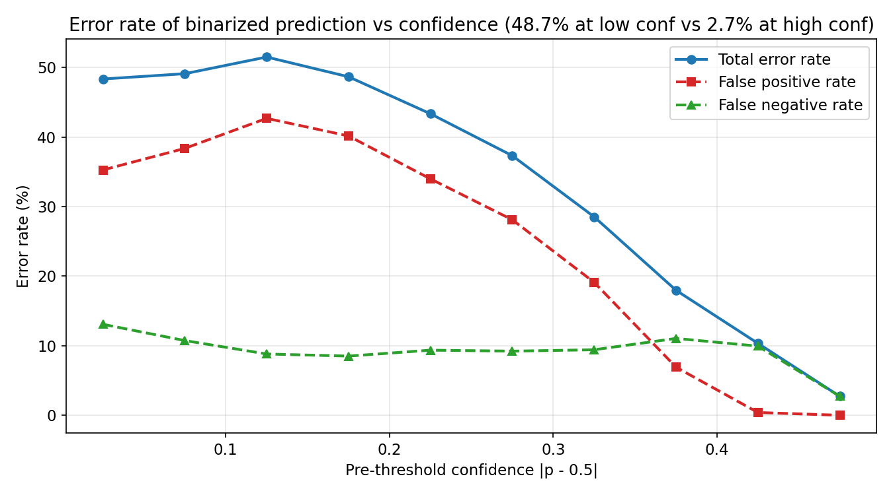
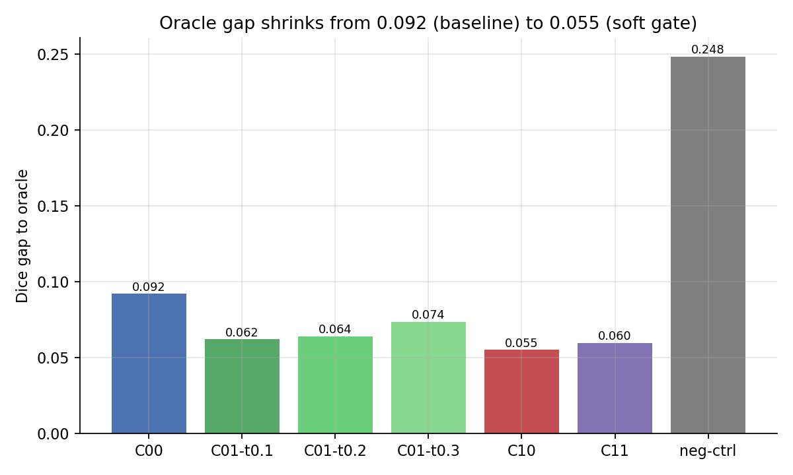
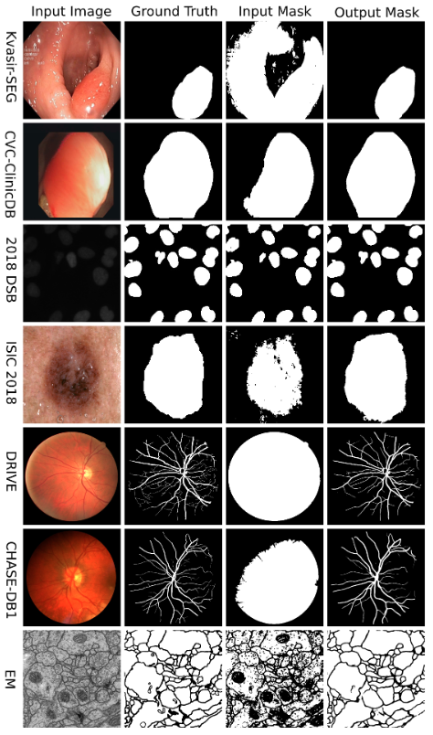

# Paper Plan — Tables, Figures, Formulas, Proofs

> Inventory dùng cho slide + paper draft. Bảng có số liệu thật từ `results/phase6_*.json`; hình nhúng trực tiếp.
> Các mục đánh dấu **[TBD]** là thí nghiệm chưa chạy (multi-seed, class-frequency, mechanism diagnosis).

## Notation

- `FB` / `no-FB`: có / không vòng feedback mask-at-input. `T00` FB×orig (seed 42), `T0N` no-FB×orig (seed 43), `TC` FB×asym, `TD` no-FB×asym (seed 43). `pp`: điểm phần trăm. `BF10`: Bayes factor.

---

## 1. Tables

### Table 1 — Dataset & evaluation protocol

| Item | Value |
|---|---|
| Dataset | Kvasir-SEG — sessile subset, 196 ảnh (156 train / 40 val), 256×256 |
| Training | 200 epochs · Adam lr 1e-4 · batch 2 · ReduceLROnPlateau (patience 5) · Kaggle T4 |
| Feedback | cross-epoch mask, cập nhật khi val-loss cải thiện, khởi tạo Otsu |
| Eval | test-time refinement 4 iterations, ngưỡng 0.5 |
| Metrics | Dice, IoU, FP%, FN%, Precision, Recall, FPR (per-image) |
| Stats | paired Wilcoxon · rank-biserial r · bootstrap 95% CI · Bayes BF10 |
| Gate | pass nếu `FP < base−0.01` & `Dice ≥ base−0.02` & `FN ≤ base+0.02`; diverge rule ep40 |

### Table 2 — Main results (40 val images)

| Cell | FB | Loss | Dice | IoU | FP% | FN% | Precision | Recall |
|---|---|---:|---:|---:|---:|---:|---:|---:|
| T00 | ✓ | DiceBCE | 0.2806 | 0.1955 | 4.62 | 6.30 | — | — |
| T0N | ✗ | DiceBCE | 0.3034 | 0.1974 | 6.53 | 5.98 | 0.4231 | 0.4431 |
| TC | ✓ | asym Tversky | 0.3315 | 0.2319 | 5.54 | 5.57 | 0.3448 | 0.4983 |
| TD | ✗ | asym Tversky | 0.3083 | 0.2129 | **3.28** | 6.68 | 0.3874 | 0.3888 |

Nguồn: `results/phase6_eval.json`.

### Table 3 — Paired statistics (vs matched baseline)

| Cell vs base | ΔDice | p | CI95 | ΔFP (pp) | p (FP) | ΔFN (pp) | Verdict |
|---|---|---|---|---|---|---|---|
| TC vs T00 | +0.0509 | .180 | [−0.034, +0.139] | +0.92 | .097 | −0.73 | FAIL |
| TD vs T0N | +0.0049 | .766 | [−0.073, +0.078] | **−3.25** | **.005** | +0.70 | **PASS** |

Bayes: BF10(Dice, TD) = 0.172 (ủng hộ null); P(ΔFP < 0) = 0.9988. Nguồn: `results/phase6_stats.json`, `phase6_stats_full.json`.

### Table 4 — Factorial 2×2 (FP%)

| | orig loss | asym loss | ΔFP (loss) |
|---|---|---|---|
| FB | 4.62 (T00) | 5.54 (TC) | +0.92 |
| no-FB | 6.53 (T0N) | 3.28 (TD) | −3.25 |
| ΔFP (feedback) | −1.91 | +2.26 | **interaction +4.17** |

Main effects: loss −1.17pp · feedback +0.17pp · interaction **+4.17pp**.

### Table 5 — All directions tried (negative-result framework)

| Direction | Cơ chế | Kết quả | Verdict | Evidence |
|---|---|---|---|---|
| Confidence-gating | giữ vùng tự tin cao | không giảm lỗi; binary tốt nhất | Bác bỏ | FROZEN |
| Dual-path (kênh nền) | thêm m_bg | FP +2.92pp (p=1e-7) | Bác bỏ | FROZEN/INVALID |
| Hồi sinh attention (STE) | STE qua ngưỡng | Dice 0.195 < 0.281 | Đóng | TRAIN |
| Loss WSDice (v1=0.3) | weighted soft dice | FP 5.19% — không giảm | Bác bỏ | TRAIN |
| Loss far-weighted (γ=5) | nặng nền xa | Dice 0.0086 collapse | Bác bỏ | TRAIN |
| Asymmetric × FB (TC) | Tversky α=0.7 | FP +0.92pp | FAIL | TRAIN |
| Asymmetric × no-FB (TD) | Tversky α=0.7 | FP −3.25pp (p=.005) | **PASS** | TRAIN |

### Table 6 — Planned studies **[TBD]**

| Study | Mục đích | Trạng thái |
|---|---|---|
| Gate 2 multi-seed TD (seeds 44,45) | củng cố claim FP | chưa chạy |
| Class-frequency weight (ENet-bounded, từ TRAIN split) | hướng advisor #2 | chưa chạy |
| Plan A — 2×2 sạch cùng seed 43 (retrain T00/T0N) | interaction hết seed-confound | chưa chạy |
| Full Kvasir-SEG / CVC-ClinicDB | power & generalizability | chưa chạy |

---

## 2. Figures

### Fig. 1 — FANet architecture

### Fig. 2 — Final metrics per cell

### Fig. 3 — Paired ΔFP: TD vs T0N (27/40 ảnh giảm FP)

### Fig. 4 — Paired ΔDice: TC vs T00 (21/40 ảnh)

### Fig. 5 — Training curves (binary val-Dice/FPR per epoch)

### Fig. 6 — Factorial main effects + interaction

### Fig. 7 — fmask không học (nhánh attention chết)

### Fig. 8 — Lỗi theo confidence (feedback quá thô)

### Fig. 9 — Oracle gap (84.6% dư địa ở vùng FP, FP cách biên 40.7px)

### Fig. 10 — Qualitative montage **[TBD]** (mẫu ví dụ hiện tại)

> Cần thay bằng grid đủ 4 cell (image, GT, T00, T0N, TC, TD) × iteration 0–4.

### Fig. 11 — Mechanism diagnosis **[TBD]** (0 GPU)
> FPR(feedback mask) vs FPR(prediction mask) qua epochs — trả lời "vì sao feedback chặn loss".

### Fig. 12 — Precision–Recall / FPR curves per cell **[TBD]**

---

## 3. Formulas

**Dice** — `DSC = 2·|P∩G| / (|P| + |G|)`

**DiceBCE (baseline loss)** — `L = 0.5·BCE(p, g) + 0.5·(1 − DSC)`

**Tversky index** (Salehi 2017) — `TI = |PG| / (|PG| + α·|P∖G| + β·|G∖P|)`, với α phạt FP, β phạt FN

**Asymmetric loss (Phase 6)** — `L_asym = 0.5·DiceBCE + 0.5·(1 − TI)`, α = 0.7, β = 0.3

**MixPool hard gate** — `keep = max(fmask, m_fg)`; dual-path: `keep = keep·(1 − m_bg)`

**Pixel importance (F³Net)** — `μ_ij = |mean_{3×3}(GT) − GT_ij|`; far-weighted: `w = 1 + γ·(1 − μ)`, γ = 5

**WSDice (IEEE Access 2020)** — `L = 1 − [2·Σ(Ĝ·G) + ε] / [ΣĜ² + ΣG² + ε]`, `Ĝ = w(2ŷ−1)`, `w = y(v2−v1) + v1`

**Interaction (2×2)** — `I = ΔFP(loss | FB) − ΔFP(loss | no-FB) = (FP_TC − FP_T00) − (FP_TD − FP_T0N) = (5.54 − 4.62) − (3.28 − 6.53) = +0.92 − (−3.25) = +4.17 pp`

**Paired Wilcoxon / Bayes** — one-sample Wilcoxon trên deltas per-image; `BF10` = Bayes factor của paired t-test (BF10 < 1/3 → ủng hộ null).

---

## 4. Proofs

### Proof 1 — Hard threshold ⇒ nhánh attention không bao giờ học được (dead branch)
- Trong gate `binary`: `g = (fmask > 0.5).float()`. Đây là hàm bậc thang: đạo hàm = 0 hầu khắp nơi.
- Do đó `∂L/∂fmask = 0` (qua gate), và mọi tham số conv của nhánh fmask không nhận gradient.
- Đo kiểm chứng: 0/160 tham số có gradient sau 10 steps; BN affine diff vs khởi tạo = 0.0000 sau 53 epochs. ∎

### Proof 2 — `m_bg = 1 − m_fg` ⇒ dual-path suy biến thành `keep = m_fg`
- Với `keep = max(fmask, m_fg) · (1 − m_bg)` và `m_bg = 1 − m_fg`:
  `1 − m_bg = m_fg` ⇒ `keep = max(fmask, m_fg) · m_fg = m_fg`.
- Hệ quả: fmask bị triệt tiêu hoàn toàn (gradient = 0), mô hình dùng mask cũ như hard gate — lý giải T01/T11 INVALID ở Phase 4 và "collapse" khi mask cũ sai. ∎

### Proof 3 — Ý nghĩa của interaction dương
- Quy ước (khớp `results/phase6_stats_full.json`): `I = ΔFP(loss | FB) − ΔFP(loss | no-FB) = (+0.92) − (−3.25) = +4.17 pp`.
- Nếu `I > 0`: hiệu ứng giảm FP của loss khi có feedback **nhỏ hơn** khi không có feedback → feedback làm *chặn/bớt* hiệu ứng loss.
- Độ lớn |I| = 4.17pp vượt xa main effect loss (−1.17pp) → mức chặn đáng kể. ∎

### Proof 4 — Soft-dice không phải bound trên của binary dice (collapse "ẩn")
- Soft dice dùng xác suất liên tục `p ∈ [0,1]`; binary dice dùng `1(p>0.5)`. Khi mô hình dự đoán ~background mọi nơi (`p ≈ 0`), soft dice ≈ `2Σp·g / (Σp + Σg)` có thể cao (ví dụ 0.19) dù sau khi cắt ngưỡng không còn foreground (binary Dice → 0.0086).
- Nên log binary val-metrics mỗi epoch; không tin loss-scale/soft-dice khi theo dõi collapse. ∎